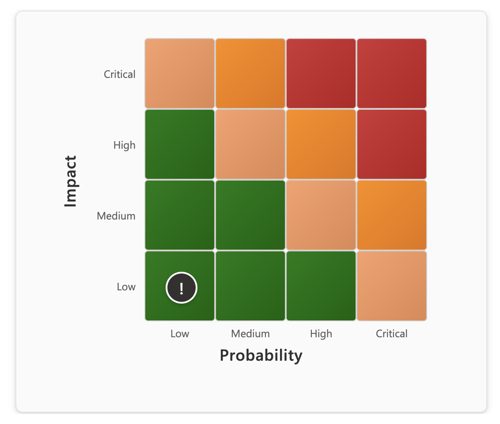
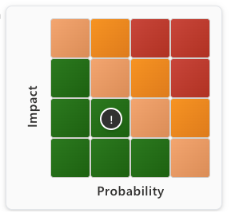

# LegalTechOps Custom PCF Components

A collection of custom Power Platform Component Framework (PCF) components created by **Maximilian Henkensiefken**. These components were developed to enhance legal operations and business process management applications.

*The "LegalTechOps" name reflects the creator's role as Head of Legal Technologies and Operations at Amadeus IT Group SA.*

## About

These components are designed to solve common business challenges through innovative Power Platform solutions. While originally developed for legal operations contexts, they can be adapted for various business applications requiring similar functionality.

## Components

This solution currently contains the following custom components:

### 🎯 Risk Matrix Component

An interactive risk assessment matrix that allows users to plot and visualize risk items based on Impact and Probability ratings.

 

#### Features
- **Interactive 4x4 Grid**: Visual risk matrix with hover effects and dynamic positioning
- **Dual Size Options**: Choose between Small (compact) and Large (detailed) display modes
- **Show/Hide Labels**: Toggle scale labels (Low, Medium, High, Critical) visibility for cleaner presentation
- **Customizable Colors**: Configurable color schemes for different risk levels (Low, Medium, High, Critical)
- **Real-time Updates**: Dynamic risk positioning based on Impact and Probability values
- **Responsive Design**: Optimized layout with precise positioning for all size configurations
- **Visual Feedback**: Clear indication of risk levels through color coding and smooth hover effects
- **Professional Styling**: Modern Fluent UI design system with smooth transitions

#### Properties
| Property | Type | Range | Description | Default |
|----------|------|-------|-------------|---------|
| `Impact` | Number | 1-4 | Impact level of the risk item | - |
| `Probability` | Number | 1-4 | Probability level of the risk item | - |
| `Size` | Choice | Small/Large | Matrix size: Small (compact) or Large (detailed) | Small |
| `ShowLabels` | Yes/No | - | Show or hide scale labels (Low, Medium, High, Critical) | Yes |
| `LowColor` | String | Hex Color | Color for low-risk areas | #107c10 |
| `MediumColor` | String | Hex Color | Color for medium-risk areas | #faa06b |
| `HighColor` | String | Hex Color | Color for high-risk areas | #ff8c00 |
| `CriticalColor` | String | Hex Color | Color for critical-risk areas | #d13438 |

#### Use Cases
- Legal risk assessments
- Compliance monitoring
- Project risk evaluation
- Strategic planning sessions
- Risk reporting dashboards

---

*Additional components will be added to this collection as they are developed.*

## Author

**Maximilian Henkensiefken**  
*Head of Legal Technologies and Operations*  
*Amadeus IT Group SA*

These components were created to address real-world business challenges encountered in legal operations and technology management. The solutions are designed to be flexible and adaptable for various business contexts beyond their original use cases.

## Installation

### Option 1: Download from Releases (Recommended)

**📥 [Download Latest Release](https://github.com/maxhenkentech/LegalTechOps-CustomPCFComponents/releases/latest)**

Visit the [Releases page](https://github.com/maxhenkentech/LegalTechOps-CustomPCFComponents/releases) to download the latest solution packages.

Choose the appropriate solution package for your needs:

- **`LegalTechOpsCustomComponents.zip`** - **Unmanaged Solution**
  - Use for development environments
  - Allows customization and modification
  - Can be exported and modified further

- **`LegalTechOpsCustomComponents_managed.zip`** - **Managed Solution** 
  - Use for production environments
  - Provides better security and stability
  - Cannot be modified after import

#### Import Steps:
1. Download the appropriate solution package from the [Releases page](https://github.com/maxhenkentech/LegalTechOps-CustomPCFComponents/releases)
2. Import the solution into your Power Platform environment:
   - Go to Power Apps > Solutions
   - Click "Import solution"
   - Select the downloaded ZIP file
   - Follow the import wizard

### Option 2: Build from Source

#### Prerequisites
- [Node.js](https://nodejs.org/) (version 12.x or later)
- [.NET SDK](https://dotnet.microsoft.com/download) (version 5.0 or later)
- [Power Platform CLI](https://docs.microsoft.com/en-us/powerapps/developer/data-platform/powerapps-cli)

#### Build Steps

1. Clone this repository:
   ```bash
   git clone <repository-url>
   cd LegalTechOpsCustomComponents
   ```

2. Install dependencies:
   ```bash
   cd src/RiskMatrix
   npm install
   ```

3. Build the component:
   ```bash
   cd ../../
   dotnet build --configuration Release
   ```

4. The packaged solution will be available at `bin/Release/LegalTechOpsCustomComponents.zip`

## Usage

1. After importing the solution, the Risk Matrix control will be available in your Power Apps
2. Add the control to a form or canvas app
3. Bind the Impact and Probability properties to your data fields
4. Optionally customize the risk colors using the color properties

## Development

### Project Structure
```
├── src/
│   ├── RiskMatrix/           # PCF component source
│   │   ├── RiskMatrix/
│   │   │   ├── index.ts      # Main component logic
│   │   │   └── ControlManifest.Input.xml
│   │   ├── package.json
│   │   └── pcfconfig.json
│   └── Other/                # Solution metadata
├── bin/Release/              # Packaged solution output
└── README.md
```

### Making Changes

1. Make your changes to the source files in component directories under `src/`
2. Test locally using `npm start` in the specific component folder
3. Build the solution using the standard Power Platform CLI commands
4. Test the packaged component in your Power Platform environment

## Troubleshooting

**Common Issues:**
- Ensure you have the latest Power Platform CLI installed
- Verify that Node.js version 14 or higher is installed
- Check that all dependencies are properly installed (`npm install`)
- Confirm the solution package is imported correctly in your environment

**Error Resolution:**
- Clear browser cache and reload the app
- Check the browser console for any JavaScript errors
- Verify the component properties are configured correctly
- Ensure the Power Platform environment supports custom PCF components

## Contributing

We welcome contributions from the community! Whether you're fixing bugs, adding new features, or improving documentation, your contributions are appreciated.

### How to Contribute
1. Fork the repository
2. Create a feature branch (`git checkout -b feature/your-feature-name`)
3. Make your changes
4. Test thoroughly
5. Commit your changes (`git commit -m 'Add some feature'`)
6. Push to the branch (`git push origin feature/your-feature-name`)
7. Open a Pull Request

### Issues
If you encounter any issues or have suggestions for improvements, please open an issue on GitHub. We encourage:
- Bug reports with detailed reproduction steps
- Feature requests with clear use cases
- Documentation improvements
- Code optimization suggestions

## Support

**Important Notice:** These components are provided **AS IS** without any support or warranty.

**Full Disclosure:** I don't know what I'm doing - pretty much everything inside this solution and its components was created using AI assistance. While the components work and have been tested, they should be thoroughly evaluated before use in production environments.

- No official support is provided for these components
- Use at your own risk in production environments
- Community support available through GitHub issues
- Contributors may provide assistance on a voluntary basis

## Release Notes

### Version 1.5.0.0 (Current)
- **NEW:** Size configuration options (Small/Large) for different display contexts
- **NEW:** ShowLabels toggle to show/hide scale labels for cleaner presentation
- Enhanced marker positioning with pixel-perfect centering
- Improved responsive layout system with 4 distinct configurations
- Optimized label positioning for all size variants

### Previous Versions
- Initial release with basic 4x4 risk matrix functionality
- Custom color configuration support
- Responsive design implementation

## License

This project is licensed under the MIT License - see the [LICENSE](LICENSE) file for details.

### MIT License Summary
- ✅ Commercial use allowed
- ✅ Modification allowed
- ✅ Distribution allowed
- ✅ Private use allowed
- ❌ No liability or warranty provided
