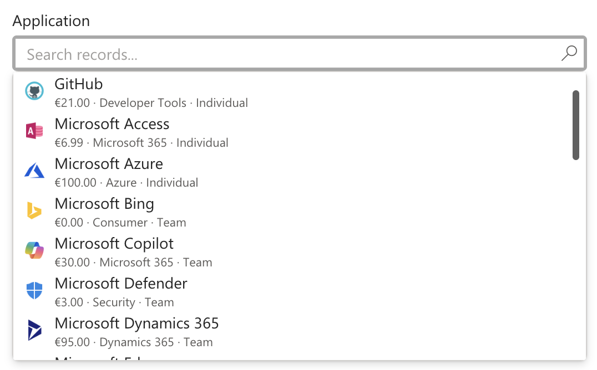
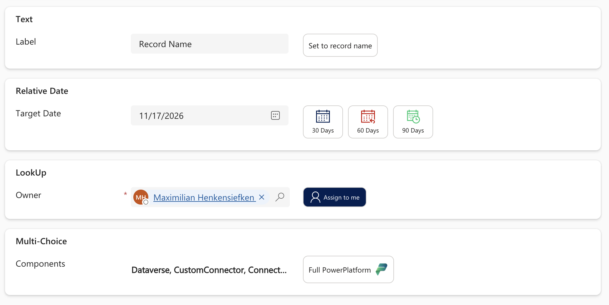

# LegalTechOps Custom PCF Components

A collection of custom Power Platform Component Framework (PCF) components created by **Maximilian Henkensiefken**. These components were developed to enhance legal operations and business process management applications.

*The "LegalTechOps" name reflects the creator's role as Head of Legal Technologies and Operations at Amadeus IT Group SA.*

## Table of Contents

- [About](#about)
- [Components](#components)
  - [🔽 Advanced Dropdown Component](#-advanced-dropdown-component)
  - [🎯 Risk Matrix Component](#-risk-matrix-component)
  - [📄 PDF Gallery Component](#-pdf-gallery-component)
  - [🌳 Relationship View Component](#-relationship-view-component)
  - [📝 Markdown Help Text Component](#-markdown-help-text-component)
  - [🔘 Modern Choice Buttons Component](#-modern-choice-buttons-component)
  - [🔍 Advanced LookUp Component](#-advanced-lookup-component)
  - [⚡ Quick Action Buttons Component](#-quick-action-buttons-component)
- [Author](#author)
- [Installation](#installation)
- [Development](#development)
- [Troubleshooting](#troubleshooting)
- [Contributing](#contributing)
- [Support](#support)
- [Release Notes](#release-notes)
- [License](#license)

## About

These components are designed to solve common business challenges through innovative Power Platform solutions. While originally developed for legal operations contexts, they can be adapted for various business applications requiring similar functionality.

## Components

This solution currently contains the following custom components. Each has its own full documentation page under [`docs/`](docs/) covering features, properties, configuration steps, and use cases - the summaries below keep just a short description and the main screenshot for each.

### 🔽 Advanced Dropdown Component

An enhanced dropdown control that extends the standard Power Platform choice field with advanced visual customization options, including color coding, custom icons, and flexible sizing.


*Modern, customizable dropdown with color coding and Fluent UI icons.*

📖 **[Full documentation](docs/AdvancedDropDown.md)** - features, properties, the External Value icon system, using your own image web resources as icons, and the [complete 1,800+ icon reference](FLUENT_ICONS.md).

---

### 🎯 Risk Matrix Component

An interactive risk assessment matrix that allows users to plot and visualize risk items based on Impact and Probability ratings.

 

*Risk Matrix component showing standard configuration with labels (left) and clean presentation without category labels (right)*

📖 **[Full documentation](docs/RiskMatrix.md)** - grid sizes, labels, colors, and properties.

---

### 📄 PDF Gallery Component

A dataset control that replaces a standard subgrid with a tabbed (or sidebar) PDF viewer - one tab per related record, rendered using the browser's own native PDF viewer (scroll, search, zoom, print) inside a responsive, A4-proportioned preview pane.

 

*Horizontal style with tabs above the preview (left) and Vertical style with a scrollable document list beside the preview (right).*

📖 **[Full documentation](docs/PDFGallery.md)** - layout styles, action buttons, the File Column fallback chain, previewing web-location links, and how to configure the underlying subgrid relationship.

---

### 🌳 Relationship View Component

A field control, bound directly to a self-referential lookup (e.g. "Parent Contract"), that replaces the field with the record's full ancestor/descendant hierarchy - one continuous tree, rendered inline on the form, with each row expandable into a live Quick View panel.


*The complete ancestor chain and descendant tree in a single view, including sister records (other Order Forms sitting alongside the same Statement of Work) and an expanded Quick View panel for the selected row.*

📖 **[Full documentation](docs/RelationshipView.md)** - tree depth, sister records, Quick View panel, thumbnails, and properties.

---

### 📝 Markdown Help Text Component

A field control that renders Markdown as formatted, visually polished help text on a form - point it at a Single Line or Multiple Lines of Text column, or type static Markdown directly into a design-time property when no backing column is wanted.


*Alert callouts, Dynamic Field Tags, Font Coloring, tables, and images, all rendered together.*

📖 **[Full documentation](docs/MarkdownHelpText.md)** - full Markdown syntax gallery, Dynamic Field Tags, Font Coloring, and properties.

---

### 🔘 Modern Choice Buttons Component

A field control that replaces a standard choice field with a horizontal row of clickable tiles - one per option, each showing an MDL2 icon above the option's own label - instead of a dropdown list.


*Icon + label tiles across circled-number, symbol, and full-color selected styles - the official PCF Gallery listing screenshot.*

📖 **[Full documentation](docs/ModernChoiceButtons.md)** - tile size/shape, color modes, icon format reference, using your own image web resources as icons, and properties.

---

### 🔍 Advanced LookUp Component

A field control that replaces a standard lookup field with a searchable, type-to-filter dropdown - type to search live Dataverse records, with a per-record icon (from a picture column, an MDL2 icon-name column, or a fixed icon) and a hover tooltip on the selected value.



*Live, server-side search with per-record icons and a smaller context line (`Additional Display Columns`) under each name.*

📖 **[Full documentation](docs/AdvancedLookUp.md)** - icon column modes, search/sort/display columns, and properties.

---

### ⚡ Quick Action Buttons Component

A field control that is not bound to any single field's value - it renders up to 5 configurable icon+label buttons, and clicking one writes a maker-configured set of field values onto the current form (field values only by default; an opt-in setting can save the record afterward), with support for Power Automate-style expressions (string/math/date functions, `coalesce`, `me()`) alongside plain literal values, including lookup and multi-select choice targets.



*Text, relative-date, lookup, and multi-select choice buttons, each writing a different kind of target field.*

📖 **[Full documentation](docs/QuickActionButtons.md)** - Actions JSON format, the expression function reference, color modes, and properties.

---

*Additional components will be added to this collection as they are developed.*

## Author

**Maximilian Henkensiefken**  
*Head of Legal Technologies and Operations*  
*Amadeus IT Group SA*

These components were created to address real-world business challenges encountered in legal operations and technology management. The solutions are designed to be flexible and adaptable for various business contexts beyond their original use cases.

## Installation

### Option 1: Download from Releases (Recommended)

**📥 [Download Latest Release](https://github.com/maxhenkentech/LegalTechOps-CustomPCFComponents/releases/latest)**

Visit the [Releases page](https://github.com/maxhenkentech/LegalTechOps-CustomPCFComponents/releases) to download the latest solution packages.

Choose the appropriate solution package for your needs:

- **`LegalTechOpsCustomComponents.zip`** - **Unmanaged Solution**
  - Use for development environments
  - Allows customization and modification
  - Can be exported and modified further

- **`LegalTechOpsCustomComponents_managed.zip`** - **Managed Solution** 
  - Use for production environments
  - Provides better security and stability
  - Cannot be modified after import

#### Import Steps:
1. Download the appropriate solution package (managed or unmanaged) from the [Releases page](https://github.com/maxhenkentech/LegalTechOps-CustomPCFComponents/releases)
2. In Power Apps, go to **Solutions** > **Import solution** and select the downloaded ZIP file
3. Open the table's form (or view, for PDF Gallery) in the form editor
4. Select the field (or add a subgrid for PDF Gallery) > **Components** > **+ Component** > **More components**, then add the desired component from this solution
5. Configure the component's properties and publish

### Option 2: Build from Source

#### Prerequisites
- [Node.js](https://nodejs.org/) (version 12.x or later)
- [.NET SDK](https://dotnet.microsoft.com/download) (version 5.0 or later)
- [Power Platform CLI](https://docs.microsoft.com/en-us/powerapps/developer/data-platform/powerapps-cli)

#### Build Steps

1. Clone this repository:
   ```bash
   git clone <repository-url>
   cd LegalTechOpsCustomComponents
   ```

2. Install dependencies:
   ```bash
   # For Advanced Dropdown component
   cd src/AdvancedDropDown
   npm install
   cd ../..
   
   # For Risk Matrix component
   cd src/RiskMatrix
   npm install
   cd ../..

   # For PDF Gallery component
   cd src/PDFGallery
   npm install
   cd ../..

   # For Relationship View component
   cd src/RelationshipView
   npm install
   cd ../..

   # For Markdown Help Text component
   cd src/MarkdownHelpText
   npm install
   cd ../..

   # For Modern Choice Buttons component
   cd src/ModernChoiceButtons
   npm install
   cd ../..

   # For Advanced LookUp component
   cd src/AdvancedLookUp
   npm install
   cd ../..

   # For Quick Action Buttons component
   cd src/QuickActionButtons
   npm install
   cd ../..
   ```

3. Build the component:
   ```bash
   cd ../../
   dotnet build --configuration Release
   ```

4. The packaged solution will be available at `bin/Release/LegalTechOpsCustomComponents.zip`

Step-by-step configuration for each component (binding, properties, and any component-specific setup like PDF Gallery's subgrid relationship) lives in that component's own doc under [`docs/`](docs/) - see the [Components](#components) section above for links.

## Development

### Project Structure
```
├── src/
│   ├── AdvancedDropDown/      # Advanced Dropdown PCF component
│   │   ├── AdvancedDropDown/
│   │   │   ├── index.ts       # Main component logic
│   │   │   ├── AdvancedOptionsControl.tsx # React component
│   │   │   ├── DropdownStyles.ts # Styling configuration
│   │   │   ├── ControlManifest.Input.xml
│   │   │   └── CSS/           # Component stylesheets
│   │   ├── package.json
│   │   └── pcfconfig.json
│   ├── RiskMatrix/            # Risk Matrix PCF component
│   │   ├── RiskMatrix/
│   │   │   ├── index.ts       # Main component logic
│   │   │   └── ControlManifest.Input.xml
│   │   ├── package.json
│   │   └── pcfconfig.json
│   ├── PDFGallery/             # PDF Gallery PCF component (dataset control)
│   │   ├── PDFGallery/
│   │   │   ├── index.ts       # Main component logic, dataset wiring
│   │   │   ├── PDFGalleryControl.tsx # React component
│   │   │   ├── TestModeData.ts # Test-harness fake documents + sample PDF
│   │   │   ├── ControlManifest.Input.xml
│   │   │   └── CSS/           # Component stylesheets
│   │   ├── package.json
│   │   └── pcfconfig.json
│   ├── RelationshipView/       # Relationship View PCF component
│   │   ├── RelationshipView/
│   │   │   ├── index.ts       # Main component logic
│   │   │   ├── RelationshipViewControl.tsx # React component
│   │   │   ├── TestModeData.ts # Test-harness fake hierarchy
│   │   │   ├── ControlManifest.Input.xml
│   │   │   └── CSS/           # Component stylesheets
│   │   ├── package.json
│   │   └── pcfconfig.json
│   ├── MarkdownHelpText/       # Markdown Help Text PCF component
│   │   ├── MarkdownHelpText/
│   │   │   ├── index.ts       # Main component logic
│   │   │   ├── MarkdownHelpTextControl.tsx # React component (react-markdown pipeline)
│   │   │   ├── AlertCallout.tsx # GitHub-style [!NOTE]/[!TIP]/etc. callout renderer
│   │   │   ├── remarkAlertCallouts.ts # Custom remark plugin for alert callout syntax
│   │   │   ├── TestModeData.ts # Test-harness sample Markdown
│   │   │   ├── ControlManifest.Input.xml
│   │   │   └── CSS/           # Component stylesheets
│   │   ├── package.json
│   │   └── pcfconfig.json
│   ├── ModernChoiceButtons/    # Modern Choice Buttons PCF component
│   │   ├── ModernChoiceButtons/
│   │   │   ├── index.ts       # Main component logic
│   │   │   ├── ModernChoiceButtonsControl.tsx # React component
│   │   │   ├── ControlManifest.Input.xml
│   │   │   └── CSS/           # Component stylesheets
│   │   ├── package.json
│   │   └── pcfconfig.json
│   ├── AdvancedLookUp/         # Advanced LookUp PCF component
│   │   ├── AdvancedLookUp/
│   │   │   ├── index.ts       # Main component logic
│   │   │   ├── AdvancedLookUpControl.tsx # React component
│   │   │   ├── ControlManifest.Input.xml
│   │   │   └── CSS/           # Component stylesheets
│   │   ├── package.json
│   │   └── pcfconfig.json
│   ├── QuickActionButtons/     # Quick Action Buttons PCF component
│   │   ├── QuickActionButtons/
│   │   │   ├── index.ts       # Main component logic
│   │   │   ├── QuickActionButtonsControl.tsx # React component
│   │   │   ├── ExpressionEngine.ts # Power Automate-style expression parser/evaluator
│   │   │   ├── XrmFieldAccess.ts # Xrm.Page read/write + type coercion
│   │   │   ├── TestModeData.ts # Test-harness fake current-record fixture
│   │   │   ├── ControlManifest.Input.xml
│   │   │   └── CSS/           # Component stylesheets
│   │   ├── package.json
│   │   └── pcfconfig.json
│   └── Other/                 # Solution metadata
├── bin/Release/               # Packaged solution output
└── README.md
```

### Making Changes

1. Make your changes to the source files in component directories under `src/`
2. Test locally using `npm start` in the specific component folder (e.g., `src/AdvancedDropDown` or `src/RiskMatrix`)
3. Build the solution using the standard Power Platform CLI commands
4. Test the packaged component in your Power Platform environment

## Troubleshooting

**Common Issues:**
- Ensure you have the latest Power Platform CLI installed
- Verify that Node.js version 14 or higher is installed
- Check that all dependencies are properly installed (`npm install`)
- Confirm the solution package is imported correctly in your environment

**Error Resolution:**
- Clear browser cache and reload the app
- Check the browser console for any JavaScript errors
- Verify the component properties are configured correctly
- Ensure the Power Platform environment supports custom PCF components

## Contributing

We welcome contributions from the community! Whether you're fixing bugs, adding new features, or improving documentation, your contributions are appreciated.

### How to Contribute
1. Fork the repository
2. Create a feature branch (`git checkout -b feature/your-feature-name`)
3. Make your changes
4. Test thoroughly
5. Commit your changes (`git commit -m 'Add some feature'`)
6. Push to the branch (`git push origin feature/your-feature-name`)
7. Open a Pull Request

### Issues
If you encounter any issues or have suggestions for improvements, please open an issue on GitHub. We encourage:
- Bug reports with detailed reproduction steps
- Feature requests with clear use cases
- Documentation improvements
- Code optimization suggestions

## Support

**Important Notice:** These components are provided **AS IS** without any support or warranty.

**Full Disclosure:** I don't know what I'm doing - pretty much everything inside this solution and its components was created using AI assistance. While the components work and have been tested, they should be thoroughly evaluated before use in production environments.

- No official support is provided for these components
- Use at your own risk in production environments
- Community support available through GitHub issues
- Contributors may provide assistance on a voluntary basis

## Release Notes

Full version history lives in [CHANGELOG.md](CHANGELOG.md).

### Version 7.2.2.0 (Current)
#### 🔍 Advanced LookUp Component
- **NEW**: `Icon Column` now accepts `<lookup field>.<column>` dot notation to pull the icon from a related record instead of only the target table itself; `Additional Search Columns` now supports lookup columns too, matched against the primary name of the record they point to.
- **FIX**: The field no longer accepted searches or selections while set to Read Only, the results dropdown no longer silently fails to appear when `Label Column` differs from the true primary name, and a stale search filter no longer survives clicking away from the field without picking a result.

See [CHANGELOG.md](CHANGELOG.md) for full details.

## License

This project is licensed under the MIT License - see the [LICENSE](LICENSE) file for details.

### MIT License Summary
- ✅ Commercial use allowed
- ✅ Modification allowed
- ✅ Distribution allowed
- ✅ Private use allowed
- ❌ No liability or warranty provided
