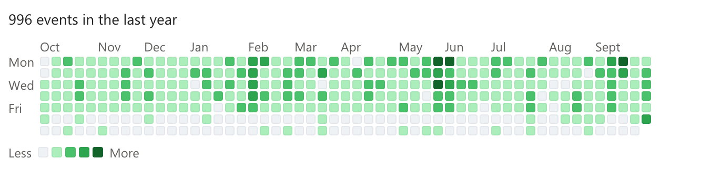
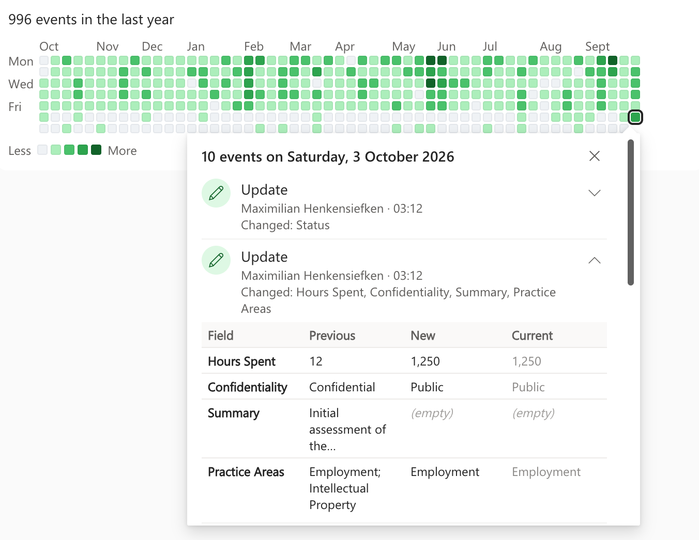
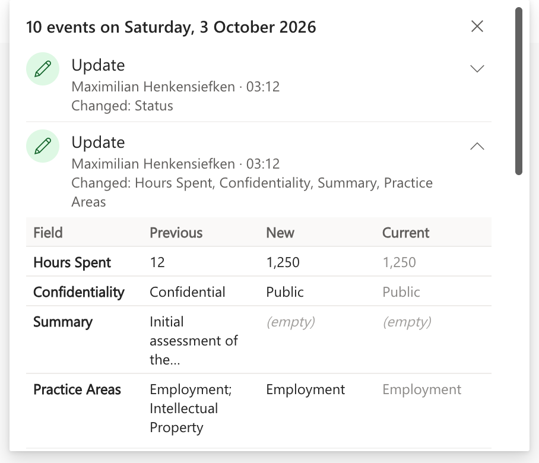
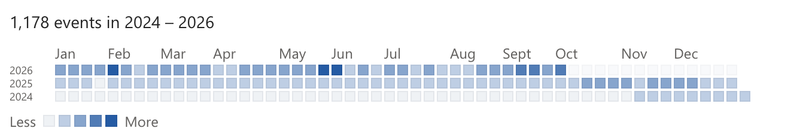
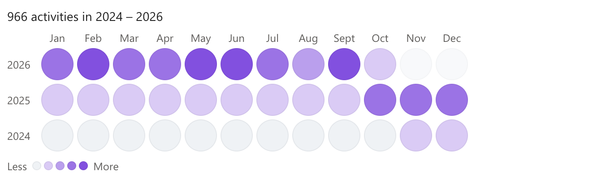
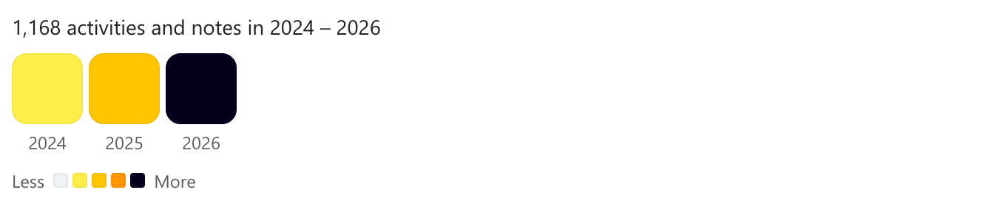
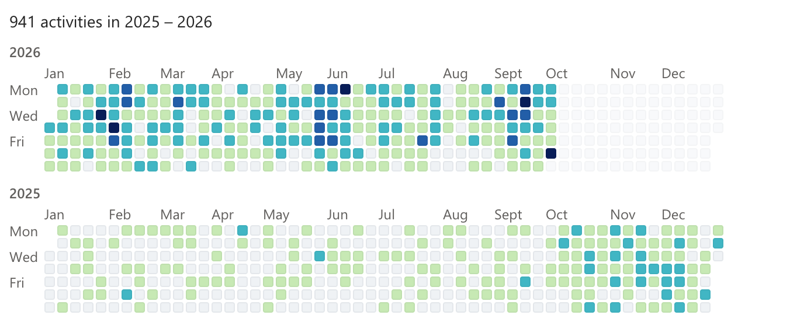
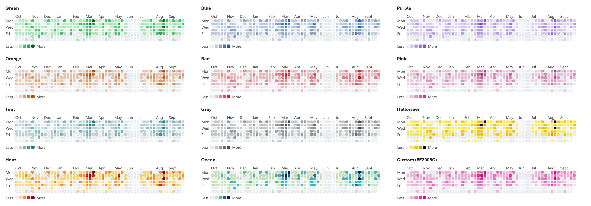
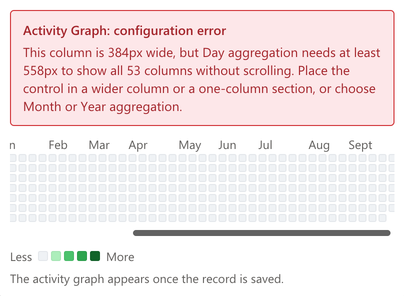

[← Back to main README](../README.md)

# 📊 Activity Graph Component

A field control that shows the history of the current record as a **GitHub-style activity graph**. Each square stands for a day, week, month or year, and the busier it was, the darker it is. The history can come from the record's **audit log** (every change), its **related activities**, its **notes**, or all of them. Click a square to see what happened then, and expand a change to see each field's previous, new and current value.

## Features
- **Four aggregations**, set with `Aggregation`:

  | Aggregation | What one square is | Layout |
  |-------------|--------------------|--------|
  | **Day** (default) | One day | Week columns with a row per weekday, like the GitHub contribution graph. Automatic range: the last 12 months |
  | **Week** | One week | One row per year, about 52 squares each |
  | **Month** | One month | One row per year, 12 squares each |
  | **Year** | One year | A single row of squares |

- **Choose the history**, set with `Source`:
  - **Audit history** (default): every create, update, assign, share and delete recorded in the audit log.
  - **Related activities**: emails, phone calls, tasks, appointments and custom activities *regarding* the record, by their created on or completed on date.
  - **Notes** attached to the record.
  - **Activities and notes**, or **Everything** together.
- **Click a square** to open a callout listing every change, activity or note in it: who, when, which fields changed, the subject of an activity (click it to open the activity) and the start of a note. The callout opens toward the middle of the graph, so it stays within the control.
- **Field-level changes**: every audit entry with changed fields has a chevron that expands a table of **Previous**, **New** and **Current** values per field:
  - Values are formatted as on the form: choice labels, lookup names, Yes/No labels, dates and times in your own time zone, numbers and currency, multi-select choices, and rich text as plain text. Long values stop after three lines; hover for the full value.
  - A field that was empty, before or after the change, shows *(empty)*.
  - **Current** is greyed when it is still the value the change set, so later changes stand out. It shows *n/a* when the field no longer exists or can't be shown (for example a party list).
- **GitHub's look**: five shades from "nothing" to "busiest", relative to the busiest square in view, a *Less → More* legend, month and weekday labels, a total such as *"996 events in the last year"*, and a tooltip on every square (*"12 events on Monday, 2 February 2026"*).
- **12 color schemes**: GitHub Green, the blue of the other LegalTechOps field controls, Purple, Orange, Red, Pink, Teal, Gray, Halloween (GitHub's own), Heat, Ocean, or shades of your own color.
- **Fits the field**: the squares grow or shrink with the column. In a column too narrow for every square, the graph scrolls and starts at the most recent end. In the **form designer**, the control shows a configuration error when its column is too narrow for the chosen aggregation, naming the width it needs.
- **Keyboard support**: Tab to the graph, move between squares with the arrow keys (each shows its tooltip), press Enter or Space to open a square, and Esc to close it.
- **Explains an empty graph**: a short note appears when auditing is turned off for the table or environment, when you don't have permission to see the audit history, activities or notes, or when the record hasn't been saved yet.
- **Follows your app theme font**: uses the font of the app's modern [custom theme](https://learn.microsoft.com/power-apps/maker/model-driven-apps/modern-theme-overrides), falling back to Segoe UI when no custom theme is set or the font can't be displayed.

*Today's square opened: ten audited changes, one of them expanded to its field-by-field Previous, New and Current values.*

*Field changes close up: a number, a Yes/No field with its own labels, a text cleared to (empty) and a multi-select choice. Current is grey where it still matches New.*

*`Aggregation` Week, `Source` Everything, `First Day Of Week` Monday, `Color Scheme` Blue, `Square Shape` Square: one row per year, since the oldest entry.*

*`Aggregation` Month, `Source` Related activities, `Color Scheme` Purple, `Square Shape` Round.*

*`Aggregation` Year, `Source` Activities and notes, `Color Scheme` Halloween.*

*`Years To Show` 2: one Day graph per calendar year, newest first. `Source` Related activities by `Activity Date` Completed on, `Color Scheme` Ocean, without the legend.*

*The 12 color schemes. Custom uses shades of `Custom Color` (here `#E3008C`).*

*In the form designer: Day needs at least 558px to show all 53 weeks, so a narrower column shows a configuration error. On the live form the graph scrolls instead.*

## Properties

Properties are listed in the order they appear in the form editor.

| Property | Type | Options | Description | Default |
|----------|------|---------|-------------|---------|
| `boundField` | Any column | - | **Required.** Bind the control to any column on the form so it can be added. The column's value is never read or changed - the graph always shows the whole record's history | - |
| `source` | Choice | Audit history / Related activities / Notes / Activities and notes / Everything | What counts as activity (see Features) | Audit history |
| `activityDate` | Choice | Created on / Completed on | Which date places a related activity in the graph. Completed on uses the actual end of a completed activity, and the created on date while it is still open | Created on |
| `aggregation` | Choice | Day / Week / Month / Year | What one square stands for | Day |
| `yearsToShow` | Whole number | 0 or more | How many calendar years to show, newest first. **0 is automatic**: the last 12 months for Day, and every year since the record was created or its oldest entry, whichever is earlier (up to 10), for Week, Month and Year. Up to 20 | 0 |
| `firstDayOfWeek` | Choice | Monday / Tuesday / Wednesday / Thursday / Friday / Saturday / Sunday / Automatic | The weekday each week column (Day) or week square (Week) starts on. Automatic uses the first day of the week from the user's personal settings | Monday |
| `showDetails` | Yes/No | - | Clicking a square opens the callout listing its changes, activities or notes | Yes |
| `showSummary` | Yes/No | - | Show the total above the graph, e.g. *"214 changes in the last year"* | Yes |
| `showLegend` | Yes/No | - | Show the *Less → More* color scale below the graph | Yes |
| `cellShape` | Choice | Square / Rounded / Round | Corner shape of the squares | Rounded |
| `colorScheme` | Choice | Green / Blue / Purple / Orange / Red / Pink / Teal / Gray / Halloween / Heat / Ocean / Custom | Colors of the five activity levels. The emptiest level is always light grey | Green |
| `customColor` | Text | Hex color | The busiest squares' color when `Color Scheme` is Custom; quieter squares use lighter shades of it. Empty or invalid falls back to Green | - |

## Configuring the Control

1. **Turn on what the graph reads**:
   - *Audit history*: auditing must be on for the environment (**Power Platform admin center** > environment > **Settings** > **Auditing**) and for the table (table **Properties** > **Audit changes to its data**). Changes are only recorded from then on. Users need the **View Audit History** and **View Audit Summary** privileges.
   - *Related activities* and *Notes*: the table must have **activities** and **attachments (notes)** enabled.
2. On the table's main form, add any column (for example the primary name column) to a section that is **wide enough**: about 560px or more for Day and Week (a one- or two-column section on most screens). Month and Year fit narrower columns.
3. Select that field, then **Components** > **+ Component** > **Activity Graph**.
4. Choose `Source`, `Aggregation` and, if you like, `Years To Show`, `First Day Of Week` and a `Color Scheme`.
5. Hide the field's label if you like, then save and publish the form.

If the form designer shows *"Activity Graph: configuration error"*, the column is too narrow for the aggregation: move the control to a wider column or a one-column section, or choose Month or Year.

## Use Cases
- **Contract and matter records**: see at a glance when a matter was busy, then drill into who changed the status, owner or budget, and what the values were.
- **Account and case records**: the rhythm of emails, calls and meetings with a customer, by week or month.
- **Audit and compliance reviews**: every change to a sensitive record over the years, field by field, with today's value next to it.
