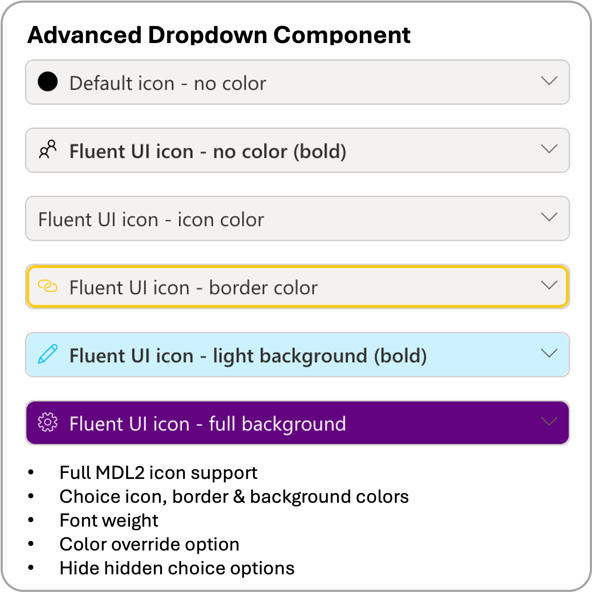
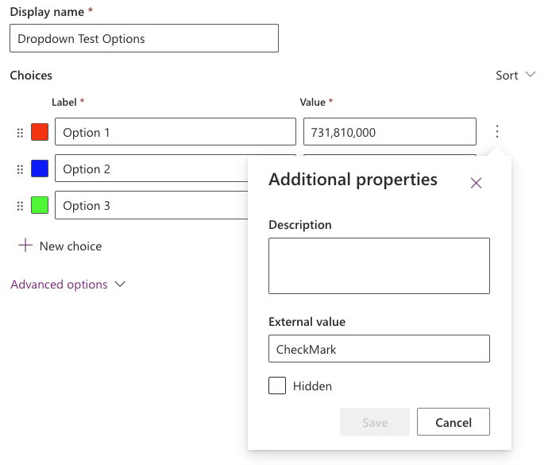

[← Back to main README](../README.md)

# 🔽 Advanced Dropdown Component

An enhanced dropdown control that extends the standard Power Platform choice field with advanced visual customization options, including color coding, custom icons, and flexible sizing.

*Modern, customizable dropdown with color coding and Fluent UI icons.*

## Features
- **Custom Icon Support**: choose from the vast majority of icons in the [Microsoft Segoe UI Symbol Font](https://learn.microsoft.com/en-us/windows/apps/design/style/segoe-ui-symbol-font) for option indicators - see the [complete 1,800+ icon reference](../FLUENT_ICONS.md) for previews
- **Color Customization**: independently color each option's icon, the dropdown's border, and its background (No/Lighter/Full intensity), sourced from the choice field's own configured colors
- **Flexible Sizing**: Tall (standard) or Short (compact) component heights
- **Smart Sorting**: sort options by numeric Value or alphabetical Text
- **Hidden Options Control**: show or hide options marked as hidden in the choice field definition
- **Typography Options**: bold font weight for better visibility
- **Color Override**: apply a single custom hex color to every option, overriding the choice field's own colors
- **Responsive Design**: optimized for both desktop and mobile Power Apps
- **Fallback System**: graceful degradation when icons fail to load in different environments

## Properties

| Property | Type | Options | Description | Default |
|----------|------|---------|-------------|---------|
| `optionsInput` | OptionSet | - | **Required.** The choice field to display as an advanced dropdown | - |
| `componentHeight` | Choice | Tall/Short | Component height: Tall (standard) or Short (compact 75% height) | Tall |
| `icon` | Text | [Segoe UI Symbol Font](https://learn.microsoft.com/en-us/windows/apps/design/style/segoe-ui-symbol-font) | Icon to display for each option (e.g., "FullCircleMask", "Circle", "StatusCircleOuter") | FullCircleMask |
| `sortBy` | Choice | Value/Text | Sort options by numeric Value or alphabetical Text | Value |
| `hideHiddenOptions` | Yes/No | - | Hide options marked as hidden in the choice field definition | Yes |
| `showColorIcon` | Yes/No | - | Display colored circular icon on the left of each option | No |
| `iconColorOverride` | Text | Hex Color | Override all option colors with custom hex color (e.g., #FF0000 or FF0000) | - |
| `showColorBorder` | Yes/No | - | Display colored border around the dropdown using the selected option's color | No |
| `showColorBackground` | Choice | No/Lighter/Full | Background color intensity: No color, Lighter (80% opacity), or Full color | No |
| `makeFontBold` | Yes/No | - | Display dropdown text in bold font weight for better readability | No |
| `useExternalValueForIcon` | Yes/No | - | Toggle to use the "External Value" field of a choice as the icon name | No |

## Icon Reference
The component supports the vast majority of icons from the [Microsoft Segoe UI Symbol Font](https://learn.microsoft.com/en-us/windows/apps/design/style/segoe-ui-symbol-font).

**📖 [Complete Icon Reference with Previews](../FLUENT_ICONS.md)** - Browse all 1,800+ available icons

Popular icon options for dropdowns include:

**Recommended Icons:**
- `FullCircleMask` - Solid filled circle (default)
- `Circle` - Outlined circle
- `StatusCircleOuter` - Status indicator circle
- `RadioBtnOn` - Radio button style
- `CircleShapeSolid` - Alternative solid circle
- `Checkbox` - Square checkbox style
- `CheckboxComposite` - Composite checkbox
- `StatusCircleCheckmark` - Circle with checkmark

**Usage Tips:**
- Use simple, recognizable shapes for best results
- Circular icons work particularly well with color customization
- Test icons in both development and production environments
- Fallback to color indicators if icons don't load

## Color Customization Guide

**Color Sources:**
1. **Choice Field Colors**: Colors defined in the Power Platform choice field
2. **Color Override**: Single hex color applied to all options (overrides choice field colors)

**Color Applications:**
- **Icons**: Color the icon itself
- **Borders**: Apply color to the dropdown border
- **Backgrounds**: Use color as background with three intensity levels:
  - **No**: No background color (default)
  - **Lighter**: 80% opacity background for subtle effect
  - **Full**: Full color background for maximum impact

**Best Practices:**
- Use **Lighter** backgrounds for better text readability
- Combine **Color Icons** with **Color Borders** for professional appearance
- **Color Override** useful for maintaining brand consistency
- Test color combinations for accessibility compliance

## Advanced Icon Features

### Using External Value for Icons
When **Use external value for icon** is enabled, the component will attempt to load a Fluent UI icon based on the string value stored in the `External Value` field of each individual Choice (OptionSet) metadata. This allows you to have different icons for every single option in your dropdown.

> [!CAUTION]
> **Architectural Implications of Using the External Value Field:**
> Repurposing the `External Value` field for UI presentation (icon names) is a convenient shortcut, but it carries significant architectural trade-offs:
> - **Metadata Pollution**: The `External Value` field is semantically intended for integration codes (e.g., ERP IDs, API keys). Using it for icons mixes UI logic with data integration logic.
> - **Potential Breaking Changes**: If another system or integration (e.g., Power Automate, Logic Apps, or an external API) relies on this field for its original purpose, setting it to a Fluent UI icon name will break those integrations.
> - **Single Purpose**: You can only use the External Value field for *one* thing. If you need it for an ERP code, you cannot use it for icons.
> - **Maintenance**: Choice metadata is managed globally in Dataverse. Changing an icon requires a metadata update, not just a configuration change in the App.

### Direct Web API Fetch
*Technical Note: Unlike standard PCF controls that use the filtered client-side metadata, this component performs a direct OData fetch to the Dataverse Web API to retrieve the "External Value" property, which is normally hidden by the Power Apps runtime to optimize performance.*

## Configuring the Control

1. After importing the solution, the Advanced Dropdown control will be available in your Power Apps
2. Add the control to a form or canvas app
3. Bind the `optionsInput` property to your choice field
4. Configure visual options:
   - Set `showColorIcon` to Yes to display colored icons
   - Choose an icon from the [Microsoft Segoe UI Symbol Font](https://learn.microsoft.com/en-us/windows/apps/design/style/segoe-ui-symbol-font)
   - Enable color borders or backgrounds as needed
   - Adjust component height (Tall/Short) based on your form layout
5. **(Optional) Per-Option Icons**:
   - Enable `Use external value for icon`.
   - In Dataverse, edit your Choice metadata and enter a Fluent UI icon name (e.g., `FavoriteStar`) into the **External Value** field for each option.

## Use Cases
- Enhanced choice fields with visual indicators
- Status dropdowns with color-coded options
- Priority selectors with clear visual hierarchy
- Category selection with branded colors
- Multi-language forms with consistent iconography
- Accessible forms with improved visual cues

---

[← Back to main README](../README.md)
