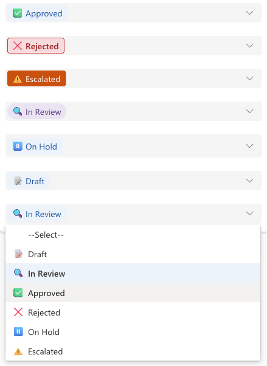
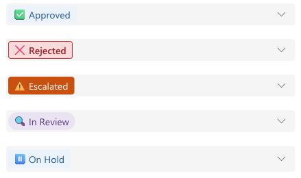
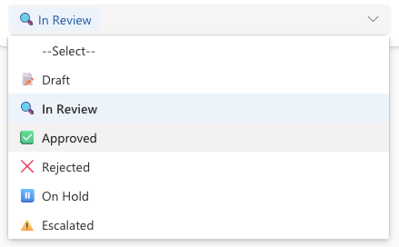
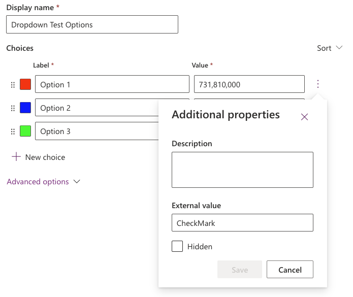

[← Back to main README](../README.md)

# 🔽 Advanced Dropdown Component

An enhanced dropdown control that extends the standard Power Platform choice field with advanced visual customization options, including color coding, custom icons, and flexible sizing.



*The selected option as a chip in each style, with colorful web resource icons, and the open options list - captured on a real model-driven form.*

## Features
- **Family look**: the selected option is shown as a tinted chip inside the grey field - the same chip, colors, spacing, and tooltip as the Advanced LookUp, Advanced Multi Choice and Advanced Yes/No components, so they all look like one family on a form
- **Custom Icon Support**: choose from 1,801 Fluent UI MDL2 icons for option indicators - see the [complete icon reference](../FLUENT_ICONS.md) for the authoritative list of names
- **Image Web Resources as Icons**: give a prefixed web resource name (e.g. `hek_MyLogo.png`) anywhere an icon name is accepted, and the control renders that image - a logo or custom mark - beside the option instead of a font glyph
- **Icon fallbacks**: separate several icon values with semicolons (e.g. `hek_Logo.png;Tag`) to try them in order - the first one that renders wins. An option's External Value falls back to the `icon` property, and if nothing renders a small dot in the icon color is shown
- **Color Customization**: color each option's icon, the chip's border, and the chip's background (No/Lighter/Full intensity), sourced from the choice field's own configured colors. Options without a color use the family blues (`#EDF3FB` background, `#255BA4` icon and border)
- **Color Override**: apply a single custom hex color to every option, overriding the choice field's own colors
- **Description tooltips**: hovering the selected option, or an option in the list, shows the option's description
- **Flexible Sizing**: Tall (standard) or Short (compact) component heights
- **Smart Sorting**: sort options by numeric Value or alphabetical Text
- **Hidden Options Control**: show or hide options marked as hidden in the choice field definition
- **Typography Options**: bold font weight for better visibility
- **Respects read-only**: when the field is read-only (set on the form, locked by a business rule, an inactive record, or column-level security) the list can't be opened, the chevron is hidden, and an empty field shows `---`
- **Follows your app theme font**: uses the font of the app's modern [custom theme](https://learn.microsoft.com/power-apps/maker/model-driven-apps/modern-theme-overrides), falling back to Segoe UI when no custom theme is set or the font can't be displayed
- **Responsive Design**: optimized for both desktop and mobile Power Apps



*The selected-value chip, top to bottom: default (neutral `#EDF3FB` chip), `Lighter` background with `Show option color border` and bold, `Full` background, `Color Override` with `Selection shape` = Round, and `Component Height` = Tall with `Selection shape` = Square. The icons are image web resources from each option's External Value.*



*The options list: the selected option in bold on `listSelectedColor`, the hovered one on `hoverColor`, each option's icon from its External Value (web resources, MDL2 icons and semicolon fallbacks), and its description as a tooltip.*

## Properties

Properties are listed in the order they appear in the form editor. Every property from earlier versions is unchanged - existing forms keep their configuration; only how it is drawn has changed (see [Color Customization Guide](#color-customization-guide)).

| Property | Type | Options | Description | Default |
|----------|------|---------|-------------|---------|
| `optionsInput` | OptionSet | - | **Required.** The choice field to display as an advanced dropdown | - |
| `hideHiddenOptions` | Yes/No | - | Hide options marked as hidden in the choice field definition | Yes |
| `sortBy` | Choice | Value/Text | Sort options by numeric Value or alphabetical Text | Value |
| `placeholderText` | Text | - | Placeholder text shown when no option is selected. A read-only empty field always shows `---` | "---" |
| `componentHeight` | Choice | Tall/Short | Component height: Tall (standard) or Short (compact) | Short |
| `selectionShape` | Choice | Square/Rounded/Round | Corner shape of the selected-value chip | Rounded |
| `makeFontBold` | Yes/No | - | Display the selected value in bold | No |
| `useExternalValueForIcon` | Yes/No | - | Use the "External Value" field of each choice option as its icon name (or [web resource name](#using-an-image-web-resource-as-an-icon)); semicolon-separated fallbacks allowed | No |
| `icon` | Text | [Fluent UI MDL2 icon name](../FLUENT_ICONS.md) or [web resource name](#using-an-image-web-resource-as-an-icon), semicolon-separated | Icon for each option, and the fallback when an External Value produced no icon | FullCircleMask |
| `showColorIcon` | Yes/No | - | Color each icon with its option color (`#255BA4` for options without one). When off, MDL2 icons use the text color and [image web resources](#using-an-image-web-resource-as-an-icon) render in greyscale | Yes |
| `showColorBackground` | Choice | No/Lighter/Full | Background of the selected-value chip: No = `selectionColor`, Lighter = faded option color, Full = option color | No |
| `selectionColor` | Text | Hex Color | Chip background when `showColorBackground` is No, and for options without a color | `#EDF3FB` |
| `showColorBorder` | Yes/No | - | Border around the selected-value chip in the option's color | No |
| `iconColorOverride` | Text | Hex Color | Override all option colors (icon, chip background and border) with one custom hex color (e.g., #FF0000 or FF0000) | - |
| `hoverColor` | Text | Hex Color | Background of the hovered option in the drop-down list | `#F3F2F1` |
| `listSelectedColor` | Text | Hex Color | Background of the selected option in the drop-down list | `#EDF3FB` |

## Icon Reference
The component renders icons from the **Fluent UI MDL2 web icon font** (`@fluentui/font-icons-mdl2`), which provides 1,801 named icons.

**📖 [Complete Icon Reference](../FLUENT_ICONS.md)** - the authoritative list of every supported name

**🔍 [flicon.io](https://www.flicon.io/)** - a searchable visual browser for this exact icon set; click an icon to copy its name

> ⚠️ Do **not** pick names from Microsoft's [Segoe Fluent Icons](https://learn.microsoft.com/en-us/windows/apps/design/style/segoe-fluent-icons-font) or [Segoe UI Symbol](https://learn.microsoft.com/en-us/windows/apps/design/style/segoe-ui-symbol-font) pages. Those document Windows *desktop system fonts*, not the MDL2 *web* font this control loads - only about a third of the names on the Segoe Fluent Icons page exist here, and the rest render as nothing. An unrecognised name falls back to the next semicolon-separated value (or the color dot) and logs a console warning.

Popular icon options for dropdowns include:

**Recommended Icons:**
- `FullCircleMask` - Solid filled circle (default)
- `Circle` - Outlined circle
- `StatusCircleOuter` - Status indicator circle
- `RadioBtnOn` - Radio button style
- `CircleShapeSolid` - Alternative solid circle
- `Checkbox` - Square checkbox style
- `CheckboxComposite` - Composite checkbox
- `StatusCircleCheckmark` - Circle with checkmark

**Usage Tips:**
- Use simple, recognizable shapes for best results
- Circular icons work particularly well with color customization
- Test icons in both development and production environments
- Add a semicolon-separated fallback (e.g. `hek_Logo.png;Tag`) for icons that might not load

## Using an Image Web Resource as an Icon

Anywhere an icon name is accepted - the `icon` property or an option's **External Value** - you can instead give the name of an **image web resource** from this environment, and the control renders that image beside the option in place of a font glyph. This is how you put a company logo, a brand mark, or any custom artwork into the dropdown.

The control tells the two apart by the **publisher prefix**: a value beginning with a prefix and an underscore (e.g. `hek_`) is treated as a web resource name, everything else as an icon name. This is unambiguous because no MDL2 icon name contains an underscore.

```
hek_MyLogo.png              a web resource in the root
hek_/images/brand.svg       a web resource in a folder
FullCircleMask              still an MDL2 icon name
```

**Setup:**

1. Upload your image as a web resource (**Solutions -> your solution -> New -> More -> Web resource**), with one of the image types listed below.
2. **Publish** it. An unpublished web resource cannot be loaded by the control.
3. Enter its full name, including the publisher prefix, as the icon value.

The extension isn't what makes it work - detection is based on the publisher prefix alone - so a web resource named without one loads just as well.

### Supported image formats

| Format | Transparency | Notes |
|---|---|---|
| **PNG** | Yes | The safe default for icons. |
| **SVG** | Yes | Best choice for vector artwork - stays sharp at any size. |
| **GIF** | Yes | Animated GIFs will animate, with no way to pause them. |
| **JPG** | **No** | See the warning below. |
| **ICO** | Yes | Renders, but usually low-resolution - it's meant for favicons. |

WEBP and AVIF are not Dataverse web resource types, so they can't be uploaded as web resources at all.

> ⚠️ **Prefer a transparent background (PNG or SVG).** The chip's background color varies with your `showColorBackground` setting and the selected option's own color. A JPG carries an opaque rectangle, so it will show as a visible box that clashes with whatever sits behind it. PNG and SVG let the background show through.

Note that scripts and external references inside an SVG are inert when loaded this way - irrelevant for icon artwork, but worth knowing if your file was exported with embedded interactivity.

### Sizing: use square images

> ⚠️ **Supply square images.** The icon slot is a 16x16 square box, matching the size of the MDL2 glyphs it sits alongside. A square source image fills it exactly.
>
> A non-square image is **fitted** to that box - scaled down until its longest side fits, keeping its aspect ratio, and letterboxed in the remaining space. Nothing is stretched or cropped, but a wide banner-shaped image ends up noticeably smaller than the other options' icons, so it will look inconsistent next to them. Crop your artwork to a square canvas (with transparent padding if needed) before uploading.

### Colors do not apply to web resource images

An image web resource is rendered **exactly as authored**. Unlike a font glyph, it cannot be recolored, so `iconColorOverride` and the option's own configured color have no effect on it. Choose artwork that reads against the background colors you have configured via `showColorBackground`.

The one setting that *does* affect it is **Show option color icon** (`showColorIcon`): when that is off - the setting that forces every glyph to flat black, i.e. "don't use color here" - image web resources are rendered in **greyscale** instead. Note that this removes color only; it does not lighten or invert the artwork, so a dark logo on a dark background stays hard to read.

### If the image cannot be loaded

If a web resource name doesn't resolve - misspelled, wrong prefix, not published, or not an image type - the control tries the next semicolon-separated value, then the `icon` property, and finally shows a small **dot** in the icon color, logging a console warning naming the URL it tried. The option is never left without an indicator.

## Color Customization Guide

The selected option is drawn as a **chip** inside the neutral grey field (the field itself no longer takes the option's color). The color settings apply to that chip:

| Setting | Effect on the chip |
|---|---|
| `showColorBackground` = **No** (default) | `selectionColor` background (`#EDF3FB`), label in a darker shade of it - the Advanced LookUp look |
| `showColorBackground` = **Lighter** | A faded version of the option's color; label in a darker shade of it |
| `showColorBackground` = **Full** | The option's color, with a white label on dark colors |
| `showColorBorder` = **Yes** | A 1px border in the option's color |
| `showColorIcon` = **Yes** (default) | Icons in the option's color |
| `iconColorOverride` | Replaces the option's color in all of the above |

**Options without a color** (and without an override) always use the family defaults: the `selectionColor` background, and `#255BA4` for the icon and border.

The drop-down list uses `hoverColor` for the hovered option and `listSelectedColor` (bold) for the selected one.

**Best Practices:**
- **Lighter** keeps each option's color recognisable while the label stays readable
- **Color Override** is useful for maintaining brand consistency
- Test color combinations for accessibility compliance

## Advanced Icon Features

### Using External Value for Icons
When **Use external value for icon** is enabled, the component will attempt to load a Fluent UI icon based on the string value stored in the `External Value` field of each individual Choice (OptionSet) metadata. This allows you to have different icons for every single option in your dropdown.



> [!CAUTION]
> **Architectural Implications of Using the External Value Field:**
> Repurposing the `External Value` field for UI presentation (icon names) is a convenient shortcut, but it carries significant architectural trade-offs:
> - **Metadata Pollution**: The `External Value` field is semantically intended for integration codes (e.g., ERP IDs, API keys). Using it for icons mixes UI logic with data integration logic.
> - **Potential Breaking Changes**: If another system or integration (e.g., Power Automate, Logic Apps, or an external API) relies on this field for its original purpose, setting it to a Fluent UI icon name will break those integrations.
> - **Single Purpose**: You can only use the External Value field for *one* thing. If you need it for an ERP code, you cannot use it for icons.
> - **Maintenance**: Choice metadata is managed globally in Dataverse. Changing an icon requires a metadata update, not just a configuration change in the App.

### Direct Web API Fetch
*Technical Note: Unlike standard PCF controls that use the filtered client-side metadata, this component performs a direct OData fetch to the Dataverse Web API to retrieve the "External Value" property, which is normally hidden by the Power Apps runtime to optimize performance.*

## Configuring the Control

1. After importing the solution, the Advanced Dropdown control will be available in your Power Apps
2. Add the control to a form or canvas app
3. Bind the `optionsInput` property to your choice field
4. Configure visual options:
   - `showColorIcon` (on by default) colors each icon with its option color
   - Choose an icon name from the [Fluent UI MDL2 icon reference](../FLUENT_ICONS.md) (or browse visually at [flicon.io](https://www.flicon.io/)), or give the name of an [image web resource](#using-an-image-web-resource-as-an-icon) to use your own artwork instead
   - Enable a colored chip background (`showColorBackground`) or border as needed
   - Adjust component height (Tall/Short) based on your form layout
5. **(Optional) Per-Option Icons**:
   - Enable `Use external value for icon`.
   - In Dataverse, edit your Choice metadata and enter a Fluent UI icon name (e.g., `FavoriteStar`) - or an [image web resource name](#using-an-image-web-resource-as-an-icon) (e.g., `hek_MyLogo.png`) - into the **External Value** field for each option.

## Use Cases
- Enhanced choice fields with visual indicators
- Status dropdowns with color-coded options
- Priority selectors with clear visual hierarchy
- Category selection with branded colors
- Multi-language forms with consistent iconography
- Accessible forms with improved visual cues

---

[← Back to main README](../README.md)
