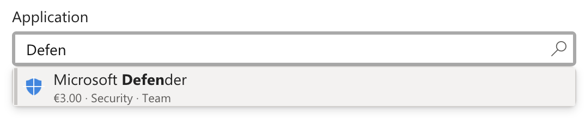
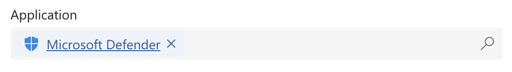

[← Back to main README](../README.md)

# 🔍 Advanced LookUp Component

A field control that replaces a standard lookup field with a searchable, type-to-filter dropdown - type directly in the field to search live Dataverse records, with a per-record icon and a hover tooltip on the selected value.

## Features
- **Type-to-Filter Search**: type directly into the field to search matching records against the target table's primary name column (plus any `Additional Search Columns`), debounced so it doesn't fire on every keystroke
- **Out-of-the-box lookup look**: styled to match the native Dataverse lookup field - flat light-grey fill, no visible border at rest, a search glyph on the right instead of a dropdown arrow - so it drops into a form without looking like a different kind of control
- **Clickable selected-record display**: once a value is selected, it renders the same way the native lookup does - an icon, the record's name as a clickable link that opens that record, and a small "x" next to it to clear the value, all on a `Record Backdrop Color` chip. The link text and the "x" are both automatically shaded to a darker tone of `Record Backdrop Color`, matching how the native lookup ties its own link/clear color to its chip color. Click anywhere else in the field to search for a different record
- **Per-Record Icon**: `Icon Column` supports three per-record sources, auto-detected from the column type -
  1. **A picture (Image) column** - shows that record's own picture
  2. **A text column holding an MDL2 icon name per record** - shows that icon
  3. **A Choice (option set) column** - shows the *selected option's label*, not its underlying numeric value, interpreted the same way a text column's value is: as an MDL2 icon name, or (if the label ends in an image extension like `.png`/`.jpg`/`.svg`) as the file name of a published web resource to show as that record's picture instead. Useful when makers should pick a record's icon from a fixed, curated list of choices rather than typing a raw MDL2 icon name into a text field
  
  Every name in `Icon Column` must be a real column on the target table (checked by the Configuration Validator below, same as every other column property) - for a literal icon shown on every record regardless of any column, use `Fixed Icon Name` instead.
  
  **Related-table icons**: use `lookupfield.column` dot notation (e.g. `lops_parentaccount.lops_thumbnail`) to pull the icon from the record a lookup field on the target table points to, instead of a column on the target table itself - useful when the picture/icon actually lives on a related record (e.g. showing a Contact's Account logo). Works for all three source types above - the column after the dot can be an Image, text, or Choice column on the related table. `lookupfield` must itself be a real lookup column on the target table (also checked by the Configuration Validator); the column after the dot is checked against the related table it points to.
- **Fixed Icon Name**: an optional literal MDL2 icon name shown as a record's icon whenever `Icon Column` produced no value for it (every configured column was blank on that record, or there was no value to fall through to), or for every record when `Icon Column` is left blank entirely. Always the lowest-priority fallback - tried only after `Icon Column`'s own fallback chain has been tried and come up empty.
- **Icon Shape**: the box drawn behind each record's icon/picture - `Full` (square, edge to edge - default), `Rounded Square`, `Circle`, or `None` (no shape at all; a picture renders at its own natural aspect ratio instead of being cropped to a square, and `Icon Background Color` is ignored)
- **Icon Background Color**: an optional hex color (e.g. `#0078D4`) painted behind each icon/picture in the shape above. Blank by default - no background is drawn
- **Icon Color**: an optional hex color (e.g. `#0078D4`) applied to MDL2 icon glyphs. Blank by default - icons render in their natural color. Has no effect on a picture or web-resource image, which keep their own colors
- **Hover Tooltip**: `Tooltip Column` shows a column's value as a tooltip when hovering over the currently selected value
- **Label Column**: shows a different column's value as each record's label (in the dropdown and the selected value) instead of the target table's primary name column - purely a display override, the value actually saved is always the true primary name
- **Fallback Columns**: `Icon Column`, `Tooltip Column`, and `Label Column` all accept a semicolon-separated list of column names (e.g. `lops_column1;lops_column2`) instead of a single one - tried in order per record, the first one with a value wins. Useful when different records populate different columns (e.g. a status icon that only some record types set). `Additional Search Columns` is a *different* delimiter/concept - comma-separated, and every listed column is searched at once rather than tried in priority order. `Additional Display Columns` also uses a semicolon, but means something different again - every listed column's value is shown together, not a fallback chain
- **Configuration Validator**: `Icon Column`, `Label Column`, `Tooltip Column`, `Additional Search Columns`, `Additional Display Columns`, `Icon Background Color`, `Icon Color`, and `Record Backdrop Color` are checked for validity - a misspelled column name (one that doesn't exist on the target table, checked individually when a fallback list is used) or an invalid color value replaces the field with a red error panel naming exactly what's wrong, instead of silently doing nothing. `Fixed Icon Name` is exempt, since it's explicitly a literal icon name, not a column reference
- **Active/Inactive Filtering**: `Show Inactive Records` controls whether inactive records are searchable (off by default, matching the native lookup control)
- **Result Limit**: caps how many matching records are shown per search (10 by default) - every search, including the initial list shown when the dropdown first opens, re-queries the server fresh; this is not a client-side page size over an already-fetched larger set
- **Additional Display Columns**: shows extra context underneath each record's name in the dropdown list (not the selected value), in smaller, muted text - e.g. `accountnumber;primarycontactid` might show "ACC-1042 · Jane Doe" under a company name. Every listed column's value is shown together (not a fallback chain - see the note on delimiters below), and every column type is supported: Choice/Status/State show their label, a Lookup/Owner/Customer column shows the referenced record's name, Currency shows the formatted amount (symbol and value together), and dates/numbers use their normal formatted display value
- **Clear Affordance**: an "x" next to the selected value resets the lookup
- **Component Height**: Tall or Short, matching Advanced Dropdown's sizing options

*Typing narrows results live (a fresh server search on every keystroke, not a client-side filter) - the matching text is bolded, and `Additional Display Columns`' context line still shows underneath even for a single result.*

*Once selected, the record renders as a clickable link (opens that record) with an inline clear "x" - matching the native Dataverse lookup field's own resting display.*

## Properties

| Property | Type | Options | Description | Default |
|----------|------|---------|-------------|---------|
| `lookupValue` | Lookup | - | **Required.** The lookup field this control replaces. Place the control directly on that field | - |
| `iconColumnName` | Text | Column logical name(s), semicolon-separated | Picture, MDL2 icon-name, or Choice column on the target table (see Features above). Every name must be a real column - use `iconFixedName` for a literal icon. Multiple names tried in order, first with a value wins. Use `lookupfield.column` to pull the icon from a related record instead (see Features above) | - |
| `iconFixedName` | Text | A literal MDL2 icon name | Icon shown when `iconColumnName` produced no value (or is blank entirely) - always the lowest-priority fallback | - |
| `iconShape` | Choice | Full / Rounded Square / Circle / None | Shape drawn behind each record's icon/picture (see Features above) | Full |
| `iconBackgroundColor` | Text | Hex color, e.g. `#0078D4` | Background color painted behind each icon/picture, in the shape above. Ignored when Icon Shape is None | - |
| `iconColor` | Text | Hex color, e.g. `#0078D4` | Color applied to MDL2 icon glyphs. Ignored for picture/web-resource images | - |
| `recordBackdropColor` | Text | Hex color, e.g. `#EDF3FB` | Background color of the chip drawn behind the selected record's icon and name | `#EDF3FB` (matches the out-of-the-box lookup) |
| `tooltipColumnName` | Text | Column logical name(s), semicolon-separated | Column whose value is shown as a tooltip when hovering the selected value. Multiple names tried in order, first with a value wins | - |
| `labelColumnName` | Text | Column logical name(s), semicolon-separated | Column shown as each record's label instead of the target table's primary name column. Display-only - the saved value is always the true primary name. Multiple names tried in order, first with a value wins | - |
| `searchColumns` | Text | Comma-separated logical names | Additional columns to search against, besides the target table's primary name column (always searched) | - |
| `sortColumnName` | Text | A single column logical name | Column to sort search results by, always ascending. Both text and number columns are supported. Falls back to the target table's primary name column when left blank | - |
| `additionalDisplayColumns` | Text | Column logical name(s), semicolon-separated | Columns shown as smaller context text underneath each record's name in the dropdown list. Every listed column's value is shown (not a fallback chain). Every column type is supported | - |
| `showInactiveRecords` | Yes/No | - | Include inactive records in search results | No |
| `resultLimit` | Whole Number | - | Maximum number of matching records shown per search - re-queried from the server on every search | 10 |
| `componentHeight` | Choice | Tall/Short | Field height | Short |
| `placeholderText` | Text | - | Placeholder shown when no record is selected | "Search records..." |

## Configuring the Control

Advanced LookUp is a **field** control bound directly to a lookup field, the same way Relationship View is bound to a self-referential lookup:

1. On the table's form, select the lookup field.
2. Add **Advanced LookUp** as a component on that field.
3. (Optional) Set `iconColumnName` to a picture column, an MDL2-icon-name text column, or a Choice column on the **target** table (the table the lookup points to, not the current table). Adjust `iconShape`, `iconBackgroundColor`, and `iconColor` to style it. Semicolon-separate multiple column names (`lops_col1;lops_col2`) to fall back to a second column when the first is blank on a given record. (Optional) Set `iconFixedName` to a literal MDL2 icon name shown when `iconColumnName` has no value for a record, or is left blank entirely.
4. (Optional) Set `tooltipColumnName` to a column on the target table to show as a hover tooltip on the selected value - same semicolon fallback-chain syntax as `iconColumnName`.
5. (Optional) Set `labelColumnName` to a column on the target table to display instead of its primary name - same semicolon fallback-chain syntax as `iconColumnName`.
6. (Optional) Set `searchColumns` to widen what a typed search matches beyond the target table's primary name column.
7. (Optional) Set `sortColumnName` to a column on the target table to sort results by (always ascending, text and number columns both supported) - leave blank to sort by the primary name column.
8. (Optional) Set `additionalDisplayColumns` to one or more columns on the target table (semicolon-separated, e.g. `accountnumber;primarycontactid`) to show as smaller context text under each record's name in the dropdown list - every column type is supported (Choice, Lookup, Currency, dates, numbers, and more).
9. Adjust `showInactiveRecords`, `resultLimit`, `componentHeight`, and `placeholderText` to match your form's needs.
10. If `iconColumnName`, `labelColumnName`, `tooltipColumnName`, `searchColumns`, `sortColumnName`, `additionalDisplayColumns`, `iconBackgroundColor`, `iconColor`, or `recordBackdropColor` are misconfigured (a column name that doesn't exist on the target table, or an invalid color), the field is replaced by a red error panel naming exactly what's wrong - fix the offending property and it disappears. `iconFixedName` is never checked this way, since it's a literal icon name rather than a column reference.

See [FLUENT_ICONS.md](../FLUENT_ICONS.md) for the full list of available MDL2 icon names for `iconColumnName`, or browse them visually at [flicon.io](https://www.flicon.io/). Names from Microsoft's [Segoe Fluent Icons](https://learn.microsoft.com/en-us/windows/apps/design/style/segoe-fluent-icons-font) page will mostly *not* work - that is a different (Windows desktop) font.

## Use Cases
- Large lookup tables (Accounts, Contacts, Products) where the native lookup dialog's search feels slow or disconnected from the form
- Lookups where a per-record icon (status, type, or category) helps a user pick the right record at a glance
- Fields where extra context (a related note, an internal ID, a status) is useful on hover without adding a second field to the form
- Similar-looking records (multiple contacts with the same name, several products in the same family) where a second line under each name in the dropdown - an account number, a city, a category - helps a user pick the right one before committing to a selection

---

[← Back to main README](../README.md)
