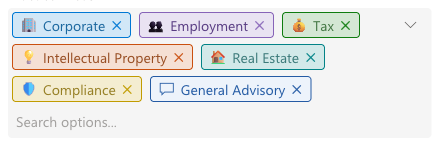
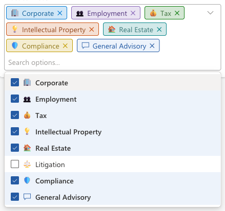
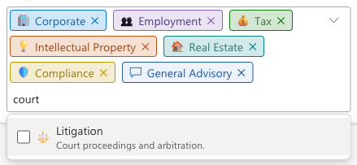
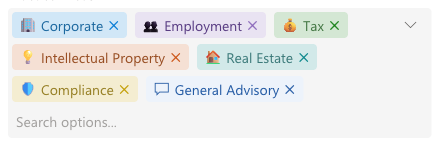
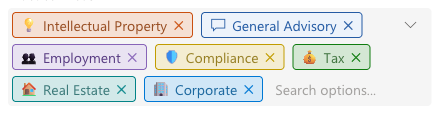

[← Back to main README](../README.md)

# 🔖 Advanced Multi Choice Component

A field control that replaces a standard **multi-select choice** field with a searchable checkbox list and shows the selected options as colored, removable pills or chips, each with its own icon and a description tooltip. It looks and behaves like the Advanced Dropdown and Advanced LookUp components, for fields where users pick more than one option.

## Features
- **Searchable checkbox list**: click the field to open a list of every option with a checkbox, its icon, and its label; click an option (or use the arrow keys and Enter) to select or deselect it. The list stays open so several options can be picked in a row.
- **Type to filter**: the search box sits to the right of the already-selected options. Typing narrows the list, matching the option label and, by default, the option's **description** too. When a match comes only from the description, the description is shown under the label so it's clear why the option appears.
- **Pills or text**: selected options are shown either as bordered **pills** or as borderless **text chips** styled like the Advanced LookUp selected record. Both wrap onto a new line when the next option no longer fits, and a label too long for the field is shortened with "…".
- **Remove with one click**: every selected option has its own × to remove it, the same × Advanced LookUp uses. Backspace in an empty search box removes the last one.
- **Icons from the choice itself**: each option's icon comes from its **External Value**, so icons are maintained with the choice column rather than in the form. Options without one fall back to the `Fixed Icon Name`. Both accept:
  - an **MDL2 icon name** (e.g. `Shield`), or
  - the name of an **image web resource** in your environment (e.g. `lops_contract.svg`). Images keep their own colors; this is how you get multi-colored icons.
  - **several values separated by semicolons**, tried in order (e.g. `lops_contract.svg;PageEdit`). The first one that works is shown, so a missing web resource or a misspelled icon name quietly falls back to the next. If nothing works, a small dot in the option's color is shown instead.
- **Description tooltips**: hovering a selected option, or an option in the list, shows its description from the choice column.
- **Color configurability**, with the same color modes as Modern Choice Buttons. The option background, pill border, and icon color can each use the option's own **choice color**, a **faded** version of it, or a **custom hex color**. Options that have no color in the choice column always use your configured hex colors exactly.
- **Three sort orders**: by option **value**, **alphabetically**, or **Autofit**, which arranges the selected options to fit into as few lines as possible and re-arranges them when the field is resized.
- **Hidden options**: options hidden in the choice are not offered, but one that is already selected is still shown and can be removed.
- **Respects read-only**: when the field is read-only (set on the form, locked by a business rule, an inactive record, or column-level security), the search box and every × are removed and the list can't be opened. Selected options and their tooltips stay visible.
- **Follows your app theme font**: uses the font of the app's modern [custom theme](https://learn.microsoft.com/power-apps/maker/model-driven-apps/modern-theme-overrides) (the `font` of its Custom theme definition), falling back to Segoe UI when no custom theme is set or the font can't be displayed

*The options list: selected options are checked and highlighted, each with the icon from its External Value.*

*Searching "court" finds Litigation through its description, which is shown under the label to explain the match.*

*`Selected values display` set to `Text`: borderless chips, matching the Advanced LookUp selected-record style.*

*`Sort by` set to `Autofit`: the same seven options as above, packed into three lines instead of four (the search box shares the last line).*

## Properties

Properties are listed in the order they appear in the form editor.

| Property | Type | Options | Description | Default |
|----------|------|---------|-------------|---------|
| `optionsInput` | Multi-select choice | - | **Required.** The multi-select choice field this control replaces. Place the control directly on that field | - |
| `hideHiddenOptions` | Yes/No | - | Don't offer options marked as hidden in the choice. Already-selected hidden options are still shown | Yes |
| `sortBy` | Choice | Value / Text / Autofit | Order of the selected options: by option value, alphabetically, or arranged to fit into as few lines as possible. The list uses value order for `Value` and `Autofit`, and alphabetical order for `Text` | Value |
| `searchDescriptions` | Yes/No | - | Also match the search text against each option's description, not only its label | Yes |
| `placeholderText` | Text | - | Search box placeholder, shown to the right of the selected options | "Search options..." |
| `selectedDisplayMode` | Choice | Pills / Text | Show selected options as bordered pills, or as borderless text chips | Pills |
| `componentHeight` | Choice | Tall / Short | Minimum field height. The field grows as options wrap onto more lines | Short |
| `selectionShape` | Choice | Square / Rounded / Round | Corner shape of each selected option, for pills and text chips | Rounded |
| `makeFontBold` | Yes/No | - | Show the selected option labels in bold | No |
| `useExternalValueForIcon` | Yes/No | - | Use each option's External Value as its icon (MDL2 name or web resource, semicolon-separated fallbacks) | Yes |
| `iconFixedName` | Text | MDL2 name or web resource name, semicolon-separated | Icon for every option whose External Value produced no icon, or for every option if the setting above is off | - |
| `iconColorMode` | Choice | Automatic / Fixed color / Choice value color / Choice value color (faded) | Color of icons, the fallback dot, and the × on each selected option. Image web resources are never recolored | Choice value color |
| `iconColor` | Text | Hex color | Icon color for `Fixed color`, and for options without a color | `#255BA4` |
| `selectionBackgroundMode` | Choice | Custom color / Choice value color / Choice value color (faded) | Background behind each selected option (pills and text chips) | Choice value color (faded) |
| `selectionColor` | Text | Hex color | Background for `Custom color`, and for options without a color | `#EDF3FB` |
| `pillBorderMode` | Choice | Off / Custom color / Choice value color / Choice value color (faded) | Pills only: border around each pill. Text chips never have a border | Choice value color |
| `pillBorderColor` | Text | Hex color | Pill border for `Custom color`, and for options without a color | `#255BA4` |
| `hoverColor` | Text | Hex color | Background of the hovered or keyboard-highlighted option in the list | `#F3F2F1` |
| `listSelectedColor` | Text | Hex color | Background of already-selected options in the list | `#EDF3FB` |

The default blues (`#EDF3FB` and `#255BA4`) are the same ones Advanced LookUp uses for its selected-record chip, so the two controls match on the same form.

## Configuring the Control

1. On the table's form, select the multi-select choice field.
2. Add **Advanced Multi Choice** as a component on that field.
3. **Icons**: in the choice column's settings, set each option's **External Value** to an MDL2 icon name or an image web resource name (optionally several, separated by semicolons, as fallbacks). Leave `useExternalValueForIcon` on. To give every option without an External Value the same icon, set `iconFixedName`.
4. **Descriptions**: add a **Description** to each option in the choice column; it becomes that option's tooltip and is searchable.
5. **Colors**: give options a **Color** in the choice column to use the choice-color modes, or switch the modes to `Custom color` and set your own hex colors.
6. Choose `selectedDisplayMode` (pills or text), `sortBy`, and the remaining layout properties, then save and publish the form.

See [FLUENT_ICONS.md](../FLUENT_ICONS.md) for the full list of available MDL2 icon names, or browse them visually at [flicon.io](https://www.flicon.io/). Names from Microsoft's [Segoe Fluent Icons](https://learn.microsoft.com/en-us/windows/apps/design/style/segoe-fluent-icons-font) page will mostly *not* work - that is a different (Windows desktop) font.

> **Architectural note**: using a choice's **External Value** for icon names repurposes a field that's normally meant for integration codes, the same trade-off Advanced Dropdown and Modern Choice Buttons make. If External Value is already used for an integration, use `iconFixedName` instead.

## Use Cases
- Tagging a matter, contract, or request with several practice areas, jurisdictions, or categories at once
- Long multi-select choices where scrolling a plain list is slow, and typing a few letters (or a word from the description) finds the right option
- Forms where the selected values should be readable at a glance, with an icon and color per option, instead of a comma-separated text line

---

[← Back to main README](../README.md)
