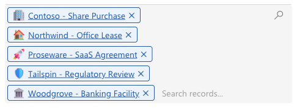
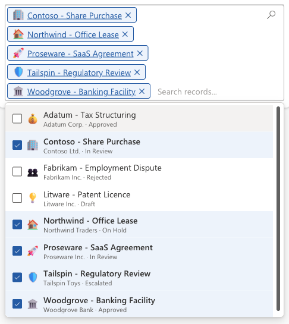
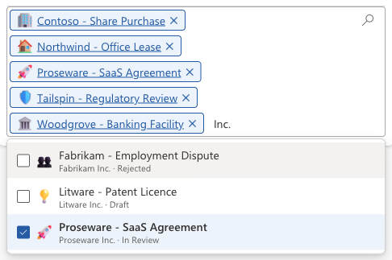
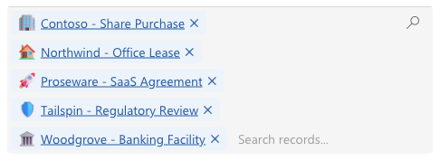
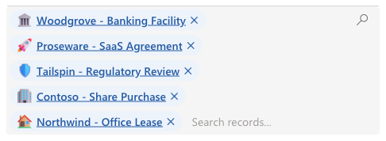
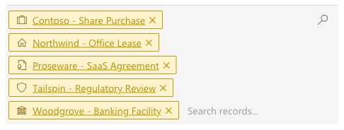
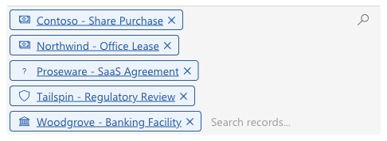

[← Back to main README](../README.md)

# 🔗 Advanced Multi LookUp Component

A control for **many-to-many (N:N) relationships**. It replaces an N:N subgrid with a searchable multi-select field: the related records are shown as pills or chips with their own icons, a type-to-filter search finds more records live in Dataverse, and ticking or removing a record adds or removes the relationship straight away. It looks like Advanced Multi Choice and searches like Advanced LookUp, with the same additional search, display, label, tooltip and icon columns.

## Features
- **N:N relationships as a field**: place the control on the subgrid of an N:N relationship. The related records appear as removable **pills** or borderless **text chips** that wrap onto new lines; long names are shortened with "…".
- **Click a name to open the record**: every selected record's name is a link, like the selected value of Advanced LookUp. Ctrl/Cmd+click opens it in a new window. The links also work when the field is read-only.
- **Live search**: click the field to see the first records, then type to search. Results come from Dataverse as you type, not from a fixed list. The search covers the related table's primary name, the `Label Column`, and any **Additional Search Columns** - text columns are searched directly, and a lookup column is searched by the name of the record it points to.
- **Context under each result**: **Additional Display Columns** show a second line under each record in the list (a client, a status, an amount, a date - choice, lookup, currency, date and number columns all show their formatted value).
- **Add and remove with one click**: ticking a record in the list, or pressing Enter on it, adds the relationship; unticking it or clicking its × removes it. Changes are saved immediately, exactly like the standard subgrid's **Add Existing** and **Remove** - not when the form is saved. If a change fails (for example, a missing privilege), it's undone and the reason is shown under the field.
- **Icons per record**, from the same options as Advanced LookUp:
  - an **Image column** (the record's picture),
  - a text column holding an **MDL2 icon name**,
  - a **Choice column** whose option label is an MDL2 icon name or an image web resource name,
  - `lookupfield.column` to take the icon from the record a lookup points to (e.g. a category's icon),
  - several of these separated by semicolons, tried in order, with `Fixed Icon Name` as the last fallback.
- **Pictures load fast**: images use Dataverse's cached image links, so they appear with the record and are not downloaded again when the list reopens or the form is revisited.
- **Tooltips**: hovering a selected record shows its `Tooltip Column` value (or its name).
- **Three sort orders** for the selected records: the **subgrid view's** order, **alphabetical**, or **Autofit**, which packs them into as few lines as possible and repacks when the field is resized.
- **Finds the relationship itself**: the N:N relationship is detected from the subgrid. Only when two N:N relationships connect the same two tables and the subgrid is empty do you need to set `Relationship Name`.
- **Respects read-only and new records**: on a read-only subgrid or an inactive record, the search box and every × are removed and nothing can be added. On a new, unsaved record the field explains that the record must be saved first, like the standard subgrid.
- **Follows your app theme font**: uses the font of the app's modern [custom theme](https://learn.microsoft.com/power-apps/maker/model-driven-apps/modern-theme-overrides), falling back to Segoe UI when no custom theme is set or the font can't be displayed.
- **Configuration errors are explained**: a column name that doesn't exist on the related table, an invalid color, or an ambiguous relationship replaces the field with a red panel naming exactly what's wrong.

*Clicking the field opens the first records: related ones are checked and highlighted, each with its picture and a context line from `Additional Display Columns` (client · status).*

*Typing "Inc." finds the matters whose client contains it - the client column is listed in `Additional Search Columns`.*

*`Selected values display` set to `Text`: borderless chips, like the Advanced LookUp selected record.*

*`Sort selected by` set to `Autofit`, with a round `Selection shape`, bold labels and no pill border.*

*An MDL2 icon-name column as `Icon Column` with circle icons, `Tall` height and custom gold colors.*

*`Icon Column` set to `hek_category.hek_categoryicon`: each matter shows the icon of its category's choice. The matter without a category falls back to the `Fixed Icon Name` (a question mark here).*

## Properties

Properties are listed in the order they appear in the form editor.

| Property | Type | Options | Description | Default |
|----------|------|---------|-------------|---------|
| `records` | Data set | - | **Required.** The related records - add the control to a subgrid of an N:N relationship | - |
| `relationshipName` | Text | N:N relationship schema name | Only needed when several N:N relationships connect the same two tables and can't be told apart (e.g. an empty subgrid). Blank detects it from the subgrid | - |
| `searchColumns` | Text | Column logical names, comma-separated | Additional columns on the related table to search, besides its primary name. Text columns are matched directly; a lookup column is matched against the name of the record it points to | - |
| `sortColumnName` | Text | Column logical name | Column to sort search results by, always ascending (text and number columns). Blank sorts by the primary name | - |
| `showInactiveRecords` | Yes/No | - | Include inactive records in the search results | No |
| `resultLimit` | Whole number | - | Maximum number of records fetched per search - re-queried on every search | 10 |
| `placeholderText` | Text | - | Search box placeholder, shown to the right of the selected records | "Search records..." |
| `labelColumnName` | Text | Column logical name(s), semicolon-separated | Column shown as each record's label instead of the primary name, in the list and the selected values. Multiple names tried in order, first with a value wins. Also searched | - |
| `additionalDisplayColumns` | Text | Column logical names, semicolon-separated | Columns shown as a smaller second line under each record in the list. Every listed value is shown (not a fallback chain); every column type is supported | - |
| `tooltipColumnName` | Text | Column logical name(s), semicolon-separated | Column whose value is the tooltip of a selected record (and of its list row). Multiple names tried in order. Blank shows the record name | - |
| `sortBy` | Choice | Subgrid view / Text / Autofit | Order of the selected records: the subgrid view's order, alphabetical, or arranged to fit into as few lines as possible | Subgrid view |
| `selectedDisplayMode` | Choice | Pills / Text | Show selected records as bordered pills, or as borderless text chips | Pills |
| `componentHeight` | Choice | Tall / Short | Minimum field height. The field grows as records wrap onto more lines | Short |
| `selectionShape` | Choice | Square / Rounded / Round | Corner shape of each selected record, for pills and text chips | Rounded |
| `makeFontBold` | Yes/No | - | Show the selected record labels in bold | No |
| `iconColumnName` | Text | Column logical name(s), semicolon-separated | Image, MDL2 icon-name or Choice column on the related table (see Features above). Multiple names tried in order. Use `lookupfield.column` to take the icon from a related record | - |
| `iconFixedName` | Text | A literal MDL2 icon name | Icon for any record where `iconColumnName` produced no value, or for every record if it's blank | - |
| `iconShape` | Choice | Full / Rounded Square / Circle / None | Shape drawn behind each icon or picture. None keeps a picture's own proportions | Full |
| `iconBackgroundColor` | Text | Hex color | Background painted behind each icon, in the shape above. Ignored for None | - |
| `iconColor` | Text | Hex color | Color of MDL2 icon glyphs. Blank uses the label color on selected records and `#255BA4` in the list. Pictures and web resources are never recolored | - |
| `selectionColor` | Text | Hex color | Background behind each selected record. The label, link and × use a darker shade of it | `#EDF3FB` |
| `pillBorderMode` | Choice | Off / Custom color | Pills only: whether each pill has a border. Text chips never have one | Custom color |
| `pillBorderColor` | Text | Hex color | Pill border color | `#255BA4` |
| `hoverColor` | Text | Hex color | Background of the hovered or keyboard-highlighted record in the list | `#F3F2F1` |
| `listSelectedColor` | Text | Hex color | Background of already-related records in the list | `#EDF3FB` |

The default blues (`#EDF3FB` and `#255BA4`) are the ones Advanced LookUp and Advanced Multi Choice use, so the three controls match on the same form.

## Configuring the Control

1. Make sure the table of your form and the table you want to relate have an **N:N (many-to-many) relationship**.
2. On the form, add a **subgrid** for that relationship: choose **Related records**, the related table, and the N:N relationship. The subgrid's view decides the order of the selected records when `sortBy` is `Subgrid view`.
3. On the subgrid's **Components** tab, add **Advanced Multi LookUp** and select it for Web, Phone and Tablet.
4. (Optional) Set `iconColumnName` to an Image, MDL2-icon-name or Choice column on the **related** table, or `lookupfield.column` to take the icon from a record it points to, and `iconFixedName` for a fallback icon.
5. (Optional) Set `labelColumnName`, `tooltipColumnName`, `searchColumns`, `additionalDisplayColumns` and `sortColumnName` to columns on the related table.
6. Choose `selectedDisplayMode`, `sortBy` and the remaining layout and color properties, then save and publish the form.
7. Users need **Append** and **Append To** privileges on both tables to add and remove relationships, as with the standard subgrid. Without them the change is undone and the error is shown under the field.

If two N:N relationships connect the same two tables, the control picks the one whose records the subgrid shows. If the subgrid is empty it can't tell them apart and asks for `relationshipName` (the error lists the candidates).

See [FLUENT_ICONS.md](../FLUENT_ICONS.md) for the full list of available MDL2 icon names, or browse them visually at [flicon.io](https://www.flicon.io/). Names from Microsoft's [Segoe Fluent Icons](https://learn.microsoft.com/en-us/windows/apps/design/style/segoe-fluent-icons-font) page will mostly *not* work - that is a different (Windows desktop) font.

## Use Cases
- Relating a matter to several contracts, parties, jurisdictions or practice areas that live in their own table
- Tagging records with a controlled list of categories that has its own icons, descriptions or owners
- Replacing a subgrid with Add Existing and a lookup dialog by one field where users search, tick and see the result at once
- N:N relationships where a second line (a client, a status, an account number) helps users pick the right record among similar names

---

[← Back to main README](../README.md)
