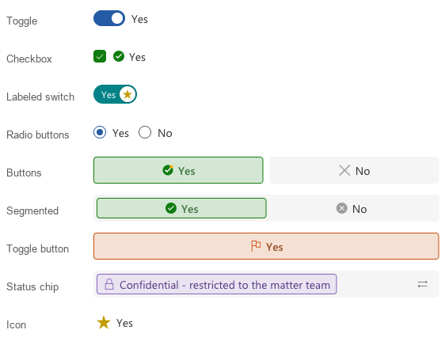
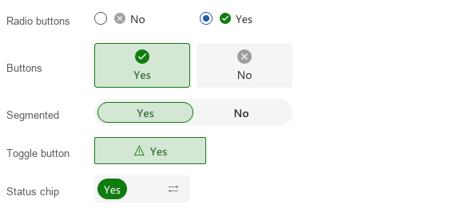
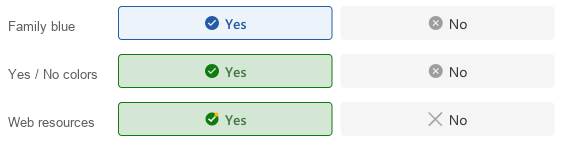
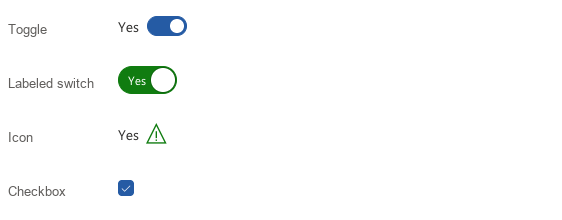
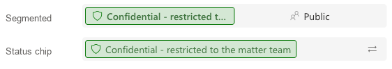

[← Back to main README](../README.md)

# ✅ Advanced Yes/No Component

A field control that replaces a standard **Yes/No** (two options) field with one of nine modern styles: a checkbox, a toggle, a labeled switch, radio buttons, two buttons, a segmented field, a single toggle button, a status chip or an icon button. You pick the icons for Yes and No in the control's settings, and the control uses the same grey field, tinted selection and blue defaults as Advanced Dropdown, Advanced LookUp and Advanced Multi Choice.

## Features
- **Nine display styles**, set per field with `Display style`:

  | Style | What it looks like | Best for |
  |-------|-------------------|----------|
  | **Toggle** (default) | A switch, on for Yes, with the current label beside it | Settings and flags |
  | **Checkbox** | A checkbox, checked for Yes | Confirmations such as "Terms accepted" |
  | **Labeled switch** | A switch with the current label inside the track and the icon inside the thumb | Compact status flags |
  | **Radio buttons** | Two classic radio buttons, one per option | Forms where both answers should be visible |
  | **Buttons** | Two separate buttons; the selected one is highlighted | Clear either-or decisions |
  | **Segmented** | Both options in one grey field, the selected one shown as a chip | A compact either-or choice matching the other field controls |
  | **Toggle button** | One button, shown pressed for Yes | Markers such as *Urgent* or *Favourite* |
  | **Status chip** | A chip showing the current option; click it to switch | Read-mostly status fields |
  | **Icon** | A single icon button, for example a flag or a star; the label is shown beside it or as a tooltip | Very compact flags |

- **Your own icons for Yes and No**: Yes/No columns have no External Values, so the icons are set on the control itself with `Yes icon` and `No icon`. Each accepts:
  - an **MDL2 icon name** (e.g. `CompletedSolid`), or
  - the name of an **image web resource** in your environment (e.g. `lops_Approved.svg`). Images keep their own colors.

  Every style except the Toggle can show them. When both are blank, only the Icon style shows an icon: a check badge for Yes and a cancel badge for No.
- **Yes and No colors**: a Yes/No column's options have no colors of their own, so `Yes color` and `No color` provide them. Every color mode can use them as they are or faded. When they are blank, the control uses the family blues (`#EDF3FB` background, `#255BA4` accent), the same as the other field controls.
- **Fill or fixed width**: Buttons, Segmented, Radio buttons, Toggle button and Status chip either fill the field or use a fixed width for each button, segment, option or chip. Fixed items shrink only when the field is narrower than their width.
- **Uses the column's own labels**: the labels come from the Yes/No column, so a column relabelled e.g. *Confidential* / *Public* shows those words. A label too long for its space is shortened with "…".
- **Layout options**: Short or Tall height (matching the other fields on the form), label left or right, Yes first or No first, icon left, right, above or below the label, square, rounded or round corners, and bold labels.
- **Keyboard support**: Tab to the control, then Space or Enter toggles it; in Radio buttons, Buttons and Segmented the arrow keys move between the two options.
- **Respects read-only**: when the field is read-only (set on the form, locked by a business rule, an inactive record, or column-level security), the value is shown but can't be changed.
- **Triggers OnChange**: every change runs the column's OnChange event exactly once, the same as the standard control.
- **Follows your app theme font**: uses the font of the app's modern [custom theme](https://learn.microsoft.com/power-apps/maker/model-driven-apps/modern-theme-overrides), falling back to Segoe UI when no custom theme is set or the font can't be displayed.

*`Width` set to `Fixed`: each button, segment, radio option or chip is `Fixed width` pixels wide (120px here, 140px for the toggle button), shown with icons above the label, round corners and a full-color chip.*

*Buttons without Yes/No colors (family blue), with `Yes color` `#107C10` and `No color` `#D13438`, and with colorful image web resources as icons.*

*`Component Height` set to `Tall`, with the label on the left for the Toggle and Icon styles, and a checkbox without a label.*

*A Yes/No column relabelled "Confidential - restricted to the matter team" / "Public": the long label is shortened where space is tight.*

## Properties

Properties are listed in the order they appear in the form editor.

| Property | Type | Options | Description | Default |
|----------|------|---------|-------------|---------|
| `value` | Yes/No | - | **Required.** The Yes/No column this control replaces. Place the control directly on that column | - |
| `displayStyle` | Choice | Checkbox / Toggle / Labeled switch / Radio buttons / Buttons / Segmented / Toggle button / Status chip / Icon | How the value is shown and changed (see the table above) | Toggle |
| `showLabels` | Yes/No | - | Show the column's option labels. Checkbox, Toggle, Labeled switch, Toggle button and Icon show the label of the current value; Radio buttons, Buttons and Segmented show one label per option | Yes |
| `labelPosition` | Choice | Right / Left | Checkbox, Toggle, Labeled switch and Icon: which side of the control the label is on | Right |
| `optionOrder` | Choice | Yes first / No first | Radio buttons, Buttons and Segmented: which option comes first | Yes first |
| `widthMode` | Choice | Fill / Fixed | Buttons, Segmented, Toggle button, Status chip and Radio buttons: fill the field, or use `Fixed width` for each item. Checkbox, Toggle, Labeled switch and Icon are not affected | Fill |
| `fixedWidth` | Whole number | Pixels | Width of each button, segment, radio option or chip when `Width` is `Fixed` | 100 |
| `componentHeight` | Choice | Tall / Short | Height of the control, matching the other form fields (34px Short, 40px Tall) | Short |
| `selectionShape` | Choice | Square / Rounded / Round | Corner shape of the buttons, segments, chip and checkbox | Rounded |
| `makeFontBold` | Yes/No | - | Show the labels in bold. The selected option of Buttons and Segmented is always bold | No |
| `yesIcon` | Text | MDL2 name or web resource name | Icon for Yes. The Icon style uses `CompletedSolid` (a check badge) when blank | - |
| `noIcon` | Text | MDL2 name or web resource name | Icon for No. The Icon style uses `StatusErrorFull` (a cancel badge) when blank | - |
| `iconPosition` | Choice | Left / Right / Above / Below | Position of the icon relative to its label. Above and Below apply to Buttons and Toggle button; the other styles treat them as Left and Right. The Toggle shows no icons | Left |
| `yesColor` | Text | Hex color | Color of the Yes option, used by every color mode set to *Yes / No color*. Blank uses each setting's fallback color | - |
| `noColor` | Text | Hex color | Color of the No option, used the same way | - |
| `iconColorMode` | Choice | Automatic / Fixed color / Yes / No color / Yes / No color (faded) | Color of MDL2 icons. Image web resources are never recolored | Yes / No color |
| `iconColor` | Text | Hex color | Icon color for `Fixed color`, and when `Yes color` / `No color` is blank | `#255BA4` |
| `checkedColorMode` | Choice | Custom color / Yes / No color / Yes / No color (faded) | Checkbox, Toggle, Labeled switch and Radio buttons: the fill when the value is Yes | Custom color |
| `checkedColor` | Text | Hex color | Checked fill for `Custom color`, and when `Yes color` is blank | `#255BA4` |
| `selectionBackgroundMode` | Choice | Custom color / Yes / No color / Yes / No color (faded) | Buttons, Segmented, Toggle button and Status chip: background of the selected option | Yes / No color (faded) |
| `selectionColor` | Text | Hex color | Selected background for `Custom color`, and when `Yes color` / `No color` is blank | `#EDF3FB` |
| `selectionBorderMode` | Choice | Off / Custom color / Yes / No color / Yes / No color (faded) | Buttons, Segmented, Toggle button and Status chip: border of the selected option | Yes / No color |
| `selectionBorderColor` | Text | Hex color | Selected border for `Custom color`, and when `Yes color` / `No color` is blank | `#255BA4` |

The default blues (`#EDF3FB` and `#255BA4`) are the ones Advanced LookUp, Advanced Dropdown and Advanced Multi Choice use for their selected value, so the controls match on the same form.

## Configuring the Control

1. On the table's form, select the Yes/No field.
2. Add **Advanced Yes/No** as a component on that field.
3. Choose a `Display style`.
4. **Icons** (optional): set `Yes icon` and `No icon` to MDL2 icon names or image web resource names. For example, `CompletedSolid` and `StatusErrorFull` give a check badge and a cancel badge.
5. **Colors** (optional): set `Yes color` and `No color` (e.g. `#107C10` and `#D13438`) to color the options, or leave them blank for the family blue. The color modes decide where each color is used.
6. Adjust the layout properties, then save and publish the form.

See [FLUENT_ICONS.md](../FLUENT_ICONS.md) for the full list of available MDL2 icon names, or browse them visually at [flicon.io](https://www.flicon.io/). Names from Microsoft's [Segoe Fluent Icons](https://learn.microsoft.com/en-us/windows/apps/design/style/segoe-fluent-icons-font) page will mostly *not* work - that is a different (Windows desktop) font.
