[← Back to main README](../README.md)

# 📝 Markdown Help Text Component

A field control that renders Markdown as formatted, visually polished help text on a form - point it at a Single Line or Multiple Lines of Text column, or type static Markdown directly into a design-time property when no backing column is wanted. Text size scales automatically with whatever font size the form's own text-size setting applies to the control's container, using relative (em) units throughout rather than a fixed pixel size.

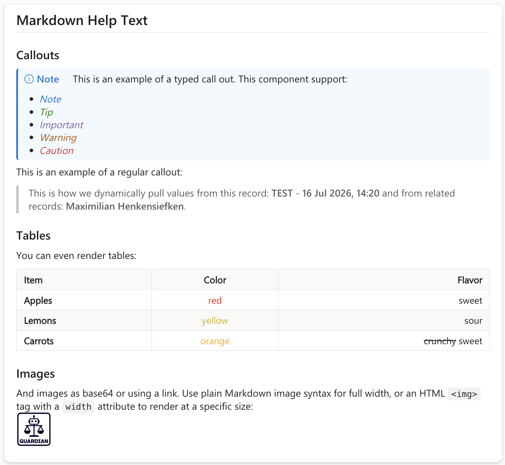

*Alert callouts, Dynamic Field Tags, Font Coloring, tables, and images, all rendered together - see the [full example](#example) below for the Markdown source.*

📖 **New to Markdown syntax?** See the [CommonMark quick reference](https://commonmark.org/help/) or the full [GitHub Flavored Markdown spec](https://github.github.com/gfm/) for complete syntax details - everything documented there, plus the GitHub-style alert callouts shown below, is supported.

## Features
- **Full CommonMark + GitHub Flavored Markdown**: headings, emphasis, lists, links, images, blockquotes, tables, task lists, and strikethrough, via [`react-markdown`](https://github.com/remarkjs/react-markdown) + [`remark-gfm`](https://github.com/remarkjs/remark-gfm) (both MIT-licensed, free for commercial use)
- **Syntax-Highlighted Code Blocks**: fenced code blocks with a language tag are highlighted via [`rehype-highlight`](https://github.com/rehypejs/rehype-highlight) (MIT)
- **GitHub-Style Alert Callouts**: a blockquote starting with `[!NOTE]`, `[!TIP]`, `[!IMPORTANT]`, `[!WARNING]`, or `[!CAUTION]` renders as a colored, icon-labeled callout box instead of a plain blockquote
- **Dynamic Field Tags**: `{!fieldLogicalName}` and `{!lookupField:targetField}` tags anywhere in the text are replaced with the current record's own field values, type-aware formatted the same way the platform itself would show them - see [Dynamic Field Tags](#dynamic-field-tags) below
- **Font Coloring**: standard `<span style="color:...">`/`<span style="background-color:...">` HTML - the same syntax GitHub, Obsidian, and most other Markdown editors already support - colors inline text; every other HTML tag, attribute, and style property is stripped rather than rendered, see [Font Coloring](#font-coloring) below
- **Configurable Callout Text Layout**: choose whether an alert callout's body text starts on the same line as its icon + label (default) or drops to its own line below
- **Configurable Line Spacing**: tune the line-height multiplier applied to all rendered text (default 1.55) to match a tighter or looser form layout
- **Two Ways to Provide Content**: bind `Text Column` to a Dataverse text column for dynamic, per-record help text, or set `Markdown Text` for static help text authored once at design time - `Text Column` takes priority when both are set, and the control can be added to a form with neither bound to any specific column
- **Scales With Form Text Size**: every element is sized in `em` relative to the control's own inherited font size, so it automatically matches whatever text size the form (or an individual field's text-size setting) applies - no manual scale property to tune
- **Safe by Default**: raw HTML embedded in the Markdown source is sanitized against an allowlist before rendering - only `<span style="color:...">`/`<span style="background-color:...">` (for [Font Coloring](#font-coloring)) survive; every other tag, attribute, and event handler (`<script>`, `onerror`, `onclick`, `url()`/`expression()` smuggled through `style`, etc.) is stripped, so there is no way to inject markup or scripts through help text sourced from an editable column
- **Read-Only**: a pure display control, like a styled label - edit the Markdown through the normal Dataverse column editor or the static design-time property, not through the control itself

## Example

The Markdown source below produces the rendering shown at the top of this page - a short, realistic example combining several features at once: alert callouts, Dynamic Field Tags, Font Coloring, a table, and an image.

```markdown
## Markdown Help Text

### Callouts

> [!TIP]
> This is an example of a typed call out. This component support:
> - *<span style="color:#0078d4">Note</span>*
> - *<span style="color:#107c10">Tip</span>*
> - *<span style="color:#8764b8">Important</span>*
> - *<span style="color:#b45400">Warning</span>*
> - *<span style="color:#d13438">Caution</span>*

This is an example of a regular callout:
> This is how we dynamically pull values from this record: **{!hek_name}** - **{!createdon}** and from related records: **{!createdby:fullname}**.

### Tables
You can even render tables:

| Item | Color | Flavor |
| -------- | :------: | -------: |
| **Apples**    | <span style="color:red">red</span> | sweet    |
| **Lemons**    | <span style="color:#d4b106">yellow</span> | sour    |
| **Carrots**   | <span style="color:orange">orange</span> | crunchy    |

### Images
And images as base64 or using a link. Use plain Markdown image syntax for full width, or an HTML `` tag with a `width` attribute to render at a specific size:

```

## Markdown Syntax Gallery

Each entry below shows the exact Markdown source next to what it renders as - type this directly into `Text Column` or `Markdown Text`. Ordered roughly by how often you'll reach for each one:

- [Headings](#headings)
- [Emphasis](#emphasis)
- [Lists](#lists)
- [Links](#links)
- [Inline Code & Fenced Code Blocks](#inline-code--fenced-code-blocks)
- [Blockquotes](#blockquotes)
- [Tables](#tables)
- [Images](#images)
- [Task Lists](#task-lists)
- [Alert Callouts](#alert-callouts)
- [Font Coloring](#font-coloring)

### Headings

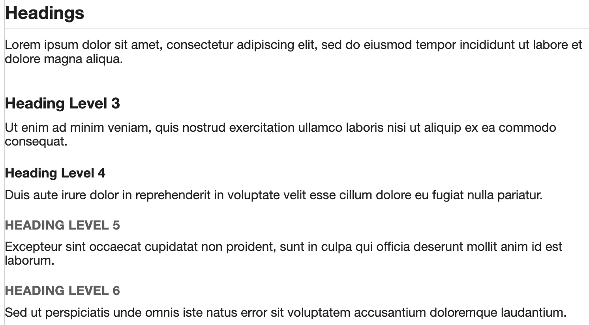

*All six heading levels (H1-H6) - a line starting with 1-6 `#` characters followed by a space.*
```markdown
# Heading Level 1
## Heading Level 2
### Heading Level 3
#### Heading Level 4
##### Heading Level 5
###### Heading Level 6
```

### Emphasis

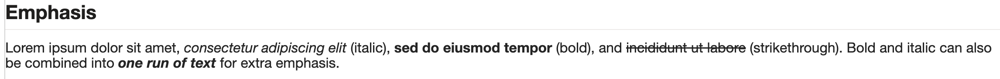

*Bold, italic, strikethrough, and combined bold+italic emphasis.*
```markdown
*italic* or _italic_
**bold** or __bold__
~~strikethrough~~
***bold and italic together***
```

### Lists

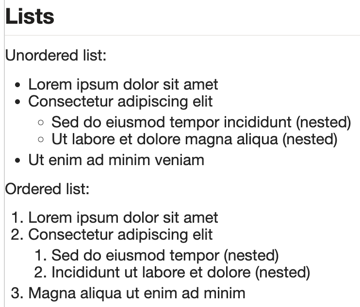

*Unordered and ordered lists, including nested sub-items - indent a sub-item two spaces under its parent.*
```markdown
- Unordered item
- Another item
  - Nested item (indent two spaces)

1. Ordered item
2. Another item
   1. Nested item (indent three spaces)
```

### Links

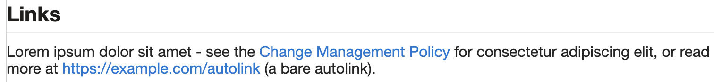

*Inline links and bare autolinks - opened via the platform's own navigation API rather than a raw page navigation.*
```markdown
[Link text](https://example.com/policy)
<https://example.com/autolink>
```

### Inline Code & Fenced Code Blocks

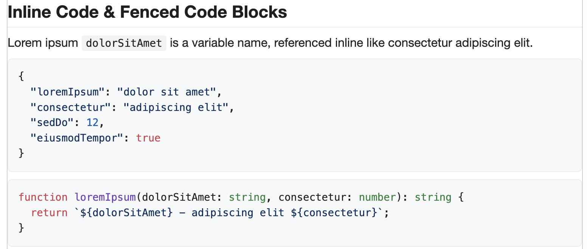

*Inline code spans (single backticks) and syntax-highlighted fenced code blocks (triple backticks with a language tag on the opening fence).*
```markdown
Reference the `variableName` inline.

\`\`\`typescript
function example(value: string): string {
  return value;
}
\`\`\`
```

### Blockquotes

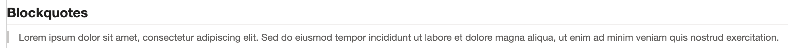

*Standard blockquotes for quoting text - a line (or lines) prefixed with `>` - see Alert Callouts below for the GitHub-style variant.*
```markdown
> Quoted text goes here, and can
> span multiple lines with each one prefixed.
```

### Tables

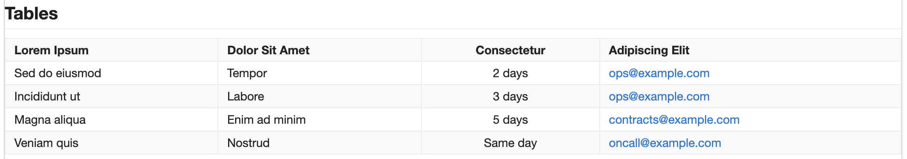

*GitHub Flavored Markdown tables, wrapped in a horizontally scrollable container so they never overflow a narrow form. The second row's dashes/colons set column alignment (`:---`, `:---:`, `---:` for left/center/right).*
```markdown
| Column A | Column B | Column C |
| -------- | :------: | -------: |
| Row 1    | centered | right    |
| Row 2    | centered | right    |
```

### Images


*Inline images, sized to fit the available width - same syntax as a link with a leading `!`. For a smaller image, use an HTML `` tag with a `width` attribute instead - it renders the same way but respects the explicit size.*
```markdown


```

### Task Lists

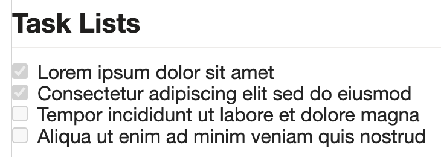

*GFM task lists - checked and unchecked items rendered as (read-only) checkboxes, using `- [x]`/`- [ ]`.*
```markdown
- [x] Completed item
- [ ] Not yet completed item
```

### Alert Callouts

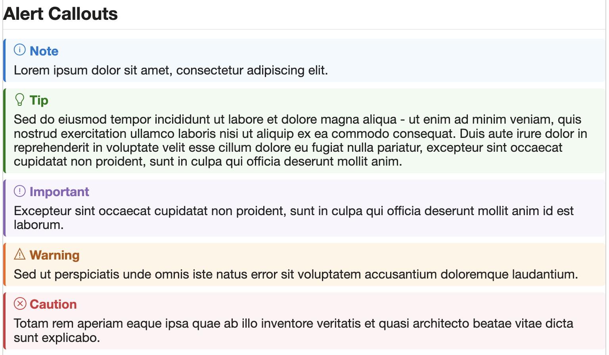

*GitHub-style alert callouts - a blockquote whose first line is one of `[!NOTE]`, `[!TIP]`, `[!IMPORTANT]`, `[!WARNING]`, or `[!CAUTION]` renders as a colored, icon-labeled box instead of a plain blockquote.*
```markdown
> [!NOTE]
> Body text for the note goes here.

> [!TIP]
> Body text for the tip goes here.

> [!IMPORTANT]
> Body text for the important callout goes here.

> [!WARNING]
> Body text for the warning goes here.

> [!CAUTION]
> Body text for the caution goes here.
```

## Dynamic Field Tags

Beyond static Markdown, the text itself can reference the current record's own field values - a tag anywhere in `Text Column` or `Markdown Text` is replaced with live data from whichever record the control is currently placed on, formatted the same way the platform itself would show it.

| Tag | Resolves to |
|-----|-------------|
| `{!fieldLogicalName}` | The named field's own value on the current record, e.g. `{!lops_status}` |
| `{!lookupField:targetField}` | `targetField`'s value on the record that lookup field `lookupField` (on the current record) currently points to, e.g. `{!lops_parentcontract:lops_status}` |

**Type-aware formatting** (the same rules the Relationship View component's Quick View panel uses):
- **Choice/Status/Boolean/text/number**: the platform's own formatted label
- **Money**: rebuilt as `<symbol> <value>` (e.g. `$ 12,500.00`)
- **Date/DateTime**: reformatted using the *browser's* own locale, not the server/org's date settings
- **Lookup/Customer/Owner**: the target record's own name

**Edge cases:**
- A field with no value set on the record renders as the word `empty`, clearly distinguishable from a typo or formatting mistake
- An unknown or malformed tag renders a short, visible `[Unknown field: fieldname]` marker instead of silently disappearing, so it's easy to spot while authoring
- A tag written inside inline code or a fenced code block is left completely untouched - useful for documenting the syntax itself without triggering it

> [!NOTE]
> Field tags cost a Web API round trip (metadata + record fetch, plus one more per distinct related record referenced through a `{!lookupField:targetField}` tag) - keep the number of distinct fields referenced reasonable on a form that loads frequently.

## Font Coloring

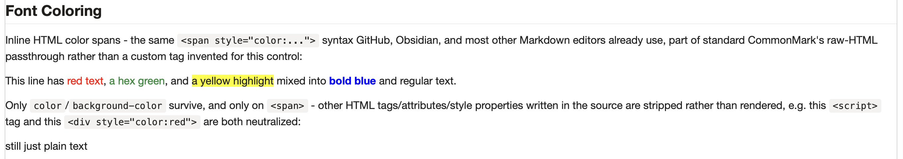

*Inline HTML color spans - the same `<span style="color:...">` syntax GitHub, Obsidian, and most other Markdown editors already support for coloring text, since it's part of standard CommonMark's raw-HTML passthrough rather than a custom tag invented for this control.*

```markdown
This line has <span style="color:red">red text</span>, <span style="color:#2b8a3e">a hex green</span>,
and <span style="background-color:yellow">a yellow highlight</span> mixed into <span style="color:blue">**bold blue**</span> and regular text.
```

Only the `color` and `background-color` CSS properties are honored, and only on a `<span>` - a hex code (`#2b8a3e`), an `rgb()`/`rgba()`/`hsl()`/`hsla()` function, or a plain CSS color name (`red`, `blue`, etc.) are all accepted values. Every other HTML tag, attribute, and style property written in the source - `<script>`, `<div style="...">`, `onclick`/`onerror`, `url(...)`/`expression(...)` smuggled inside a `style` value - is stripped down to plain text rather than rendered, so this remains safe to use with a user-editable text column.

> [!NOTE]
> Markdown emphasis (`**bold**`, `*italic*`, etc.) still works nested inside a color span, since the span is just inline HTML wrapping ordinary Markdown content - see `**bold blue**` in the example above.

## Properties

| Property | Type | Options | Description | Default |
|----------|------|---------|-------------|---------|
| `boundText` (Text Column) | Single Line/Multiple Lines of Text | - | Optional: a text column containing Markdown. Takes priority over Markdown Text when both are set. Leave unbound to use this as a static help-text component with no backing column | - |
| `markdownText` (Markdown Text) | Multiple Lines of Text | - | Static Markdown, set at design time, used when Text Column is not bound or has no value | - |
| `calloutTextLayout` (Callout Text Layout) | Choice | SameLine/NewLine | Where an alert callout's body text starts relative to its icon + label: on the same line as the label, or on the line below it | SameLine |
| `lineSpacing` (Line Spacing) | Decimal | - | Line height multiplier applied to all rendered text | 1.55 |

## Configuring the Control

Markdown Help Text can be used two ways, and both can be configured on the same instance:

1. **Bound to a column** - place the control directly on a Single Line or Multiple Lines of Text field, the same way Risk Matrix is placed on a field. Whatever Markdown is stored in that column renders live.
2. **Static, no column needed** - insert the control as a standalone component (not bound to any field) and set `Markdown Text` to the desired Markdown directly in the form designer. Useful for banner-style guidance that does not need to vary per record.
3. Author Markdown using standard [CommonMark](https://commonmark.org/help/)/[GFM](https://github.github.com/gfm/) syntax - tables, task lists, code fences, and `> [!NOTE]`/`[!TIP]`/`[!IMPORTANT]`/`[!WARNING]`/`[!CAUTION]` alert callouts are all supported out of the box
4. Reference the current record's own field values inline with `{!fieldLogicalName}`, or a related record's field via `{!lookupField:targetField}` - see [Dynamic Field Tags](#dynamic-field-tags)
5. Tune presentation with `calloutTextLayout` (Same Line/New Line for alert callout body text) and `lineSpacing` (line-height multiplier) if the defaults don't match your form's density

> [!TIP]
> To combine both: bind `Text Column` for the common case, and leave `Markdown Text` set as a fallback shown only for records where that column is empty.

> [!NOTE]
> `calloutTextLayout` and `lineSpacing` apply to the whole control instance, not per alert type or per paragraph - set them once to match the density/style of the form section the control sits in.

## Use Cases
- Contextual guidance/instructions placed above a section of a form
- Policy or process reminders that need bold text, links, or a checklist, not just plain text
- Per-record dynamic help text (e.g. a different reminder depending on record type or status) via a calculated or manually-set text column
- Rich release notes, warnings, or "what changed" banners that need more than a single line of plain text
- Record summaries that weave the record's own field values directly into a sentence (e.g. "This contract expires on `{!lops_expirationdate}` and is owned by `{!lops_parentcontract:lops_accountmanager}`") instead of leaving makers to lay out separate read-only fields

---

[← Back to main README](../README.md)
