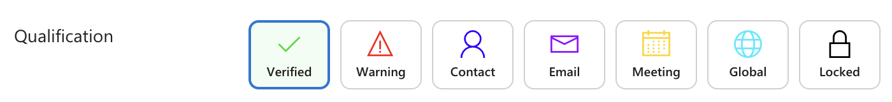
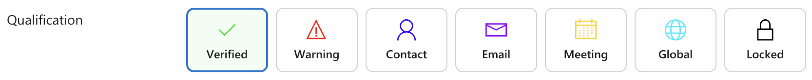
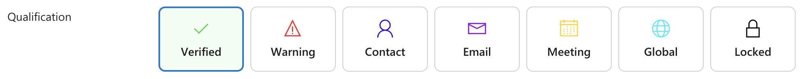
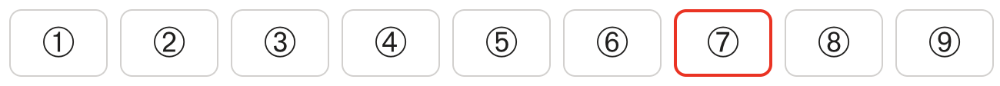
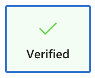
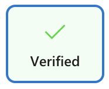
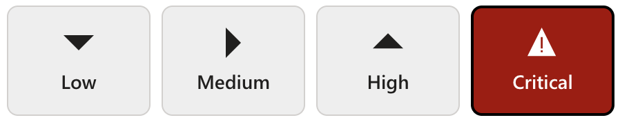
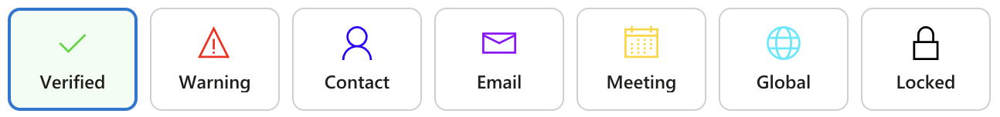
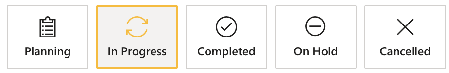
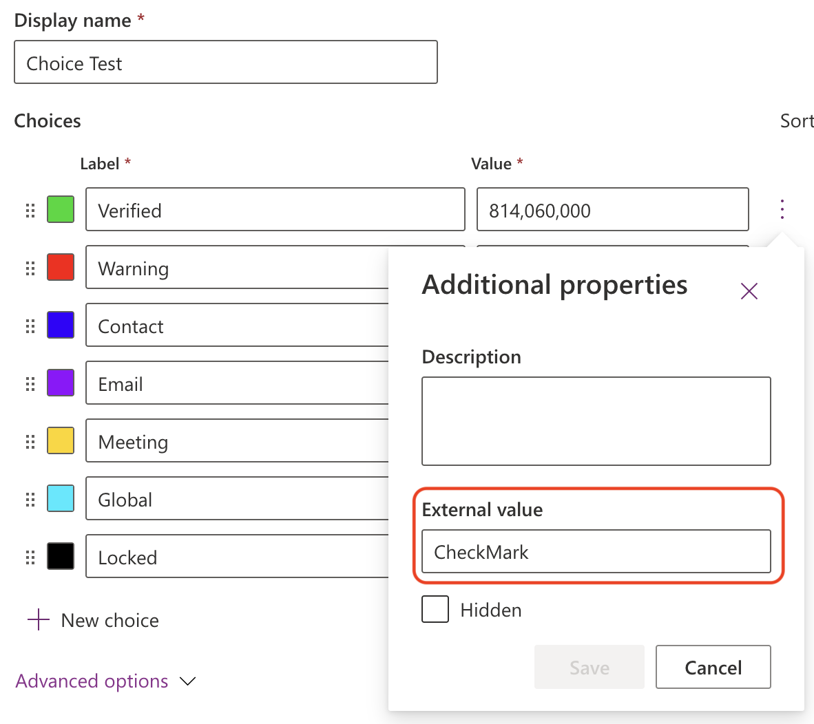

[← Back to main README](../README.md)

# 🔘 Modern Choice Buttons Component

A field control that replaces a standard choice field with a horizontal row of clickable tiles - one per option, each showing an MDL2 icon above the option's own label - instead of a dropdown list.

*Icon + label tiles across circled-number, symbol, and full-color selected styles - the official PCF Gallery listing screenshot.*

## Features
- **Icon + Label Tiles**: every option renders as a tile with an icon above its literal choice-set label, wrapping to a new row automatically when there isn't enough horizontal space
- **Full MDL2 Icon Support**: a default icon for every tile, or a per-option JSON map (`{"<value>":{"icon":"IconName"}}`), the same icon-name/Unicode/CSS-class resolution AdvancedDropDown uses
- **External Value as Icon Source**: enable `Use external value for icon` to have each option's own `External Value` field (fetched directly from the Dataverse Web API, bypassing the PCF SDK) supply its icon name - the same technique and trade-offs as Advanced Dropdown's equivalent feature
- **Independent Background & Border Color Modes**: the selected tile's background and border are each independently configurable - a custom hex color, or the choice option's own configured color - with the border able to be turned off entirely
- **Configurable Not-Selected / Hover / Selected Colors**: hex color properties for a tile's resting, hovered, and (custom-mode) selected background
- **Tile Shape**: Square or Rounded corners
- **Tile Size**: Small, Normal, or Large - adjusts tile padding and label text size while keeping the icon itself a fixed size
- **Icon Color Scope**: apply Icon color mode to every tile's icon, or only the selected tile's icon (other tiles then use automatic contrast)
- **Automatic Contrast**: icon and label color switch between light and dark automatically based on the tile's current background
- **Hidden Options & Sorting**: hide options marked hidden in the choice field, and sort tiles by Value or Text, same as Advanced Dropdown

### Tile Size

*Small*

*Normal (default) - tiles render about 33% larger than Small (max-width 128px vs 96px).*

*Large - tiles render about 67% larger than Small (max-width 160px vs 96px).*

*Small tiles with `showChoiceValue` set to No - the label is hidden and the icon renders larger, centered in the tile.*

### Tile Shape

 

*`tileShape` set to Square (left) vs Rounded (right).*

### Selected Tile Color Modes

*`selectedBackgroundMode` set to `ChoiceColor` - the selected tile's background uses the option's own configured choice color, at Large tile size.*

*`iconColorScope` set to `AllTiles` - every tile's icon (not just the selected one) is colored, paired with a faded choice-color background.*

*Square tiles with `selectedBorderMode` set to `ChoiceColor` and `iconColorScope` set to `SelectedOnly` - only the selected tile's icon and border pick up the option's own color.*

## Properties

| Property | Type | Options | Description | Default |
|----------|------|---------|-------------|---------|
| `optionsInput` | OptionSet | - | **Required.** The choice field to display as a row of tiles | - |
| `icon` | Text | [Segoe UI Symbol Font](https://learn.microsoft.com/en-us/windows/apps/design/style/segoe-ui-symbol-font) or JSON | Default icon for every tile, or a JSON map of choice value to icon (e.g. `{"1":{"icon":"Accept"}}`) | RadioBtnOff |
| `useExternalValueForIcon` | Yes/No | - | Use each option's `External Value` field as its icon name instead | No |
| `hideHiddenOptions` | Yes/No | - | Hide options marked as hidden in the choice field definition | Yes |
| `sortBy` | Choice | Value/Text | Sort tiles by numeric Value or alphabetical Text | Value |
| `tileShape` | Choice | Square/Rounded | Corner shape of each tile | Rounded |
| `tileSize` | Choice | Small/Normal/Large | Overall tile size (padding, min/max width, and label text size). The icon itself stays a fixed size regardless of this setting | Normal |
| `showChoiceValue` | Yes/No | - | Show the choice option's text label under the icon. When off, the label is hidden and the icon renders larger, centered in the tile | Yes |
| `makeFontBold` | Yes/No | - | Display the tile label in bold font weight | No |
| `notSelectedColor` | Text | Hex Color | Background color of a tile that is not selected | #FFFFFF |
| `hoverColor` | Text | Hex Color | Background color of a tile while hovered | #DEECF9 |
| `selectedBackgroundMode` | Choice | CustomColor/ChoiceColor | Whether the selected tile's background uses `selectedColor` or the option's own configured color | CustomColor |
| `selectedColor` | Text | Hex Color | Background color of the selected tile when `selectedBackgroundMode` is Custom color | #F3F2F1 |
| `selectedBorderMode` | Choice | Off/CustomColor/ChoiceColor | Whether the selected tile has a border, and whether it's a custom color or the option's own color | CustomColor |
| `selectedBorderColor` | Text | Hex Color | Border color of the selected tile when `selectedBorderMode` is Custom color | #0078D4 |
| `iconColorScope` | Choice | AllTiles/SelectedOnly | Whether Icon color mode is applied to every tile's icon, or only the selected tile's icon (other tiles then use automatic contrast) | AllTiles |

## Icon Format Reference

The `icon` property (and each per-option JSON `icon` value) accepts three kinds of values:

1. **An MDL2 icon name** (e.g. `CheckMark`) - looked up in the [Segoe Fluent Icons font](https://learn.microsoft.com/en-us/windows/apps/design/style/segoe-fluent-icons-font).
2. **A CSS icon class** (`ms-Icon`/`fabric-icon`/`icon-` prefixed, or a value starting with `.`).
3. **Any Unicode character**, entered as an escape - not limited to a fixed list, this works for any character the MDL2 icon set doesn't cover. Accepted formats: `\uXXXX`, `U+XXXX`, `&#xXXXX;`, or `0xXXXX` (4 hex digits). The character renders through the browser's own Symbol/Dingbat font fallback (`Segoe MDL2 Assets, Segoe UI Symbol, Symbols`) rather than the MDL2 icon glyph font, so it's worth a visual check on each platform/browser you support.

A few examples spanning different Unicode blocks:

| Character | Meaning | `icon` value to enter |
|---|---|---|
| ✓ | Check mark | `\u2713` |
| ✗ | Cross / X mark | `\u2717` |
| ★ | Star | `\u2605` |
| → | Right arrow | `\u2192` |
| ⚠ | Warning triangle | `\u26A0` |
| ① | Circled digit 1 | `\u2460` |

**Circled numbers 1-9** are one case worth calling out, since MDL2 has no circled-digit icons of its own. The plain style above (`\u2460` for 1, sequentially through `\u2468` for 9) is one option; the Dingbats block also has three bolder/rounder variants - `\u2776`-`\u277E` (filled, serif), `\u2780`-`\u2788` (outlined, sans-serif), and `\u278A`-`\u2792` (filled, sans-serif). The last of these gives the most modern, rounded "badge" look: ➊ ➋ ➌ ➍ ➎ ➏ ➐ ➑ ➒.

## Configuring the Control

Modern Choice Buttons is a **field** control, bound the same way as Advanced Dropdown - place it directly on the choice field:

1. On the table's form, select the choice (OptionSet) field.
2. Add **Modern Choice Buttons** as a component on that field.
3. Configure `icon` (or `useExternalValueForIcon`) so every option has a recognizable icon, and adjust the color/shape properties to match your form's design.
   - Set `selectedBackgroundMode`/`selectedBorderMode` to `ChoiceColor` to use each option's own configured color, or leave as `CustomColor` and tune `notSelectedColor`/`hoverColor`/`selectedColor`/`selectedBorderColor`
   - Choose `tileShape` (Square/Rounded) and `tileSize` (Small/Normal/Large) to match your form's design language
   - Set `iconColorScope` to `SelectedOnly` if you only want the selected tile's icon to pick up Icon color mode, leaving other tiles' icons at automatic contrast

**(Optional) Per-Option Icons via External Value:**

1. Enable `Use external value for icon`.
2. In Dataverse, edit your Choice metadata and enter a Fluent UI icon name (e.g., `CheckMark`) into the **External Value** field for each option.

> [!CAUTION]
> **Architectural Implications of Using the External Value Field:**
> Repurposing the `External Value` field for UI presentation (icon names) is a convenient shortcut, but it carries significant architectural trade-offs:
> - **Metadata Pollution**: The `External Value` field is semantically intended for integration codes (e.g., ERP IDs, API keys). Using it for icons mixes UI logic with data integration logic.
> - **Potential Breaking Changes**: If another system or integration (e.g., Power Automate, Logic Apps, or an external API) relies on this field for its original purpose, setting it to a Fluent UI icon name will break those integrations.
> - **Single Purpose**: You can only use the External Value field for *one* thing. If you need it for an ERP code, you cannot use it for icons.
> - **Maintenance**: Choice metadata is managed globally in Dataverse. Changing an icon requires a metadata update, not just a configuration change in the App.

## Use Cases
- Status or stage selectors where a single click beats opening a dropdown
- Priority/severity pickers where the icon carries meaning at a glance
- Category selection on touch-friendly or tablet-oriented forms
- Any choice field where the option list is short and visual recognition matters more than a compact dropdown

---

[← Back to main README](../README.md)
