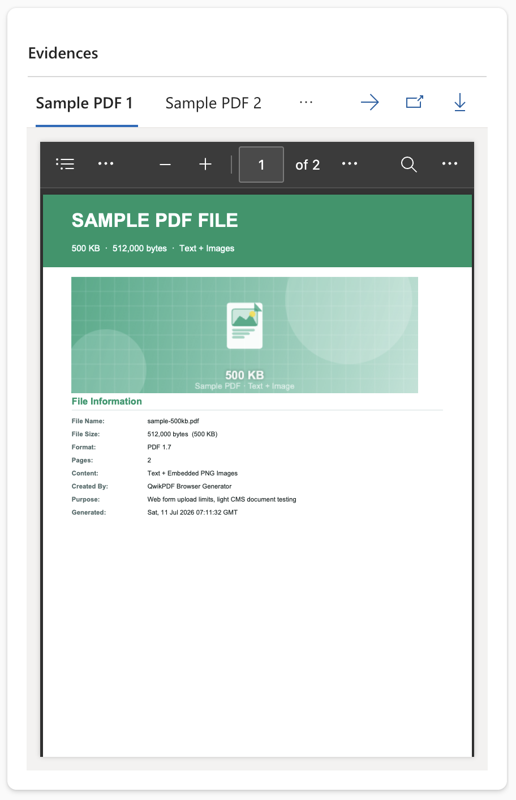
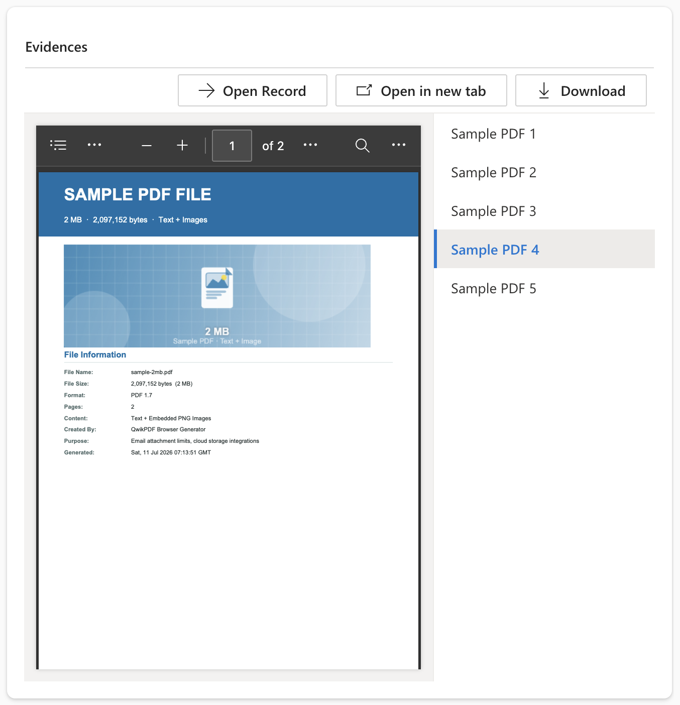
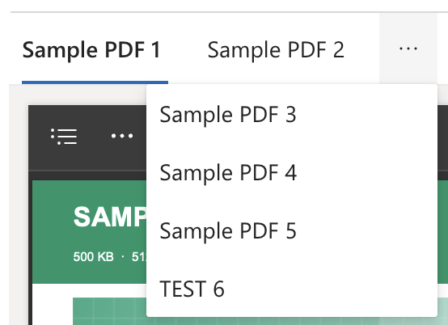
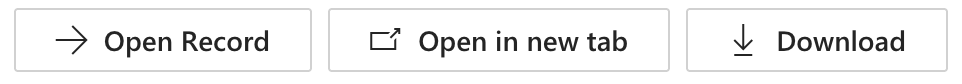
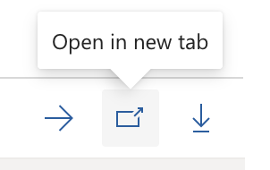

[← Back to main README](../README.md)

# 📄 PDF Gallery Component

A dataset control that replaces a standard subgrid with a tabbed (or sidebar) PDF viewer - one tab per related record, rendered using the browser's own native PDF viewer (scroll, search, zoom, print) inside a responsive, A4-proportioned preview pane.

 

*Horizontal style with tabs above the preview (left) and Vertical style with a scrollable document list beside the preview (right).*

*When there are more documents than fit in the tab row, they automatically collapse into a "..." overflow menu.*

 

*`Show Button Labels` toggles between text+icon buttons (left) and compact icon-only buttons with a hover tooltip (right).*

## Features
- **Native Browser PDF Preview**: renders each related PDF using the browser's own built-in viewer - no bundled PDF renderer, so scroll, in-document search, zoom, and print all work exactly as they do for any PDF opened directly in the browser
- **Two Layout Styles**: `Horizontal` tabs above the preview (with an automatic overflow menu once tabs stop fitting) or `Vertical` - a scrollable document list beside the preview, ideal for narrower form sections
- **Full Related-Record Loading**: automatically pages through the *entire* related-record set rather than just the subgrid's first page, so documents don't silently disappear when a subgrid's page size is small
- **Configurable Action Buttons**: independently toggle **Open Record** (navigate to the underlying Dataverse form), **Open in New Tab**, and **Download** - each shown with a label or as a compact icon with a hover tooltip
- **Truncated Tab Labels**: configurable character limit for horizontal tab labels, always paired with the full document name as a hover tooltip; Vertical style truncates based on the sidebar's actual available width instead of a fixed count
- **A4-Proportioned Preview**: the preview pane keeps a 210:297 aspect ratio and scales responsively to whatever space the maker allocates on the form, rather than a hardcoded pixel size
- **Direct Web API File Retrieval**: Dataverse File columns never expose their bytes or file name through the standard PCF dataset column API, so this component fetches both directly from the Dataverse Web API (see technical note below)
- **Graceful Handling of Non-PDF Files**: if a configured File column happens to hold something other than a PDF, the component detects it (via file signature) and shows a clear "can't be previewed here" message instead of a broken viewer - Download still works normally, and Open in New Tab is safely disabled for that document
- **Test Harness Support**: ships with representative fake documents and an embedded sample PDF, so the control can be developed and previewed with `npm start` without a live Dataverse connection

## Properties

| Property | Type | Options | Description | Default |
|----------|------|---------|-------------|---------|
| `documents` | Dataset | - | **Required.** The related records to display - bind this by configuring the subgrid's relationship and view, exactly as you would for a normal subgrid (see [Configuring the Relationship](#configuring-the-relationship) below) | - |
| `fileColumnName` | Text | - | **Required.** Logical (schema) name of the File column on the related table that holds the PDF, e.g. `lops_pdffile` | - |
| `tabLabelColumnName` | Text | - | Optional logical name of the column to use as the document label. Defaults to the file's own name when left blank | - |
| `allowDownload` | Yes/No | - | Show or hide the Download button | Yes |
| `showButtonLabels` | Yes/No | - | Show text labels on the action buttons. When off, only icons are shown, with the label available as a hover tooltip | No |
| `tabLabelMaxChars` | Number | - | Maximum characters shown per tab label (Horizontal style only) before truncating with an ellipsis. The full name is always available as a hover tooltip | 15 |
| `allowOpenRecord` | Yes/No | - | Show an **Open Record** button that navigates to the Dataverse form for the record currently displayed in the viewer | No |
| `style` | Choice | Horizontal/Vertical | Layout of the document selector: tabs above the preview, or a scrollable list beside the preview | Horizontal |

## Configuring the Relationship

Unlike the other components, PDF Gallery is a **dataset** control - it replaces a subgrid's rendering rather than binding to a single field. Add it to a form exactly like a normal subgrid:

1. Add a **Subgrid** component to the form.
2. Under **Records**, select the 1:N relationship to the child table that stores the PDFs (**not** an unfiltered/generic view of that table - it must be the relationship-filtered "Related Records" option, otherwise every row in the child table will show up regardless of which parent record you're on).
3. Under **Components**, add **PDF Gallery** and set `fileColumnName` to the logical name of the child table's File column.

> [!NOTE]
> **Why file bytes and names need a separate fetch:** A Dataverse **File column** (the dedicated File data type, distinct from Notes/Attachments) cannot be retrieved through a dataset's normal `getValue`/column API - that only ever returns an opaque file ID, never the bytes or the display name. This component works around that by calling the Dataverse Web API directly: `GET /api/data/v9.2/<entitySetName>(<id>)/<fileColumnLogicalName>/$value` for the bytes, and `context.webAPI.retrieveRecord` for the automatically-generated `<fileColumn>_name` companion column. The entity's collection name (`EntitySetName`) is resolved once per session and cached. This is the same "bypass the PCF SDK, call the Web API directly" technique the Advanced Dropdown component uses for its External Value icons.

## Configuring the Control

1. After importing the solution, add a **Subgrid** component to a form (this is a dataset control, not a field-bound one)
2. Under **Records**, pick the 1:N relationship to the child table storing the PDFs (must be the relationship-filtered option, not a generic view)
3. Under **Components**, add **PDF Gallery**
4. Set `fileColumnName` to the logical name of the child table's File column
5. Configure the optional properties as needed:
   - `tabLabelColumnName` to label documents by a specific column instead of the file name
   - `style` to choose `Horizontal` (tabs) or `Vertical` (sidebar list)
   - `allowOpenRecord`, `allowDownload`, `showButtonLabels`, and `tabLabelMaxChars` to tune the action buttons and tab labels

## Use Cases
- Contract or legal document review panels
- Evidence/attachment galleries on case or matter records
- Any 1:N relationship where the related table stores a PDF in a Dataverse File column and a plain row-based subgrid isn't the experience you want

---

[← Back to main README](../README.md)
