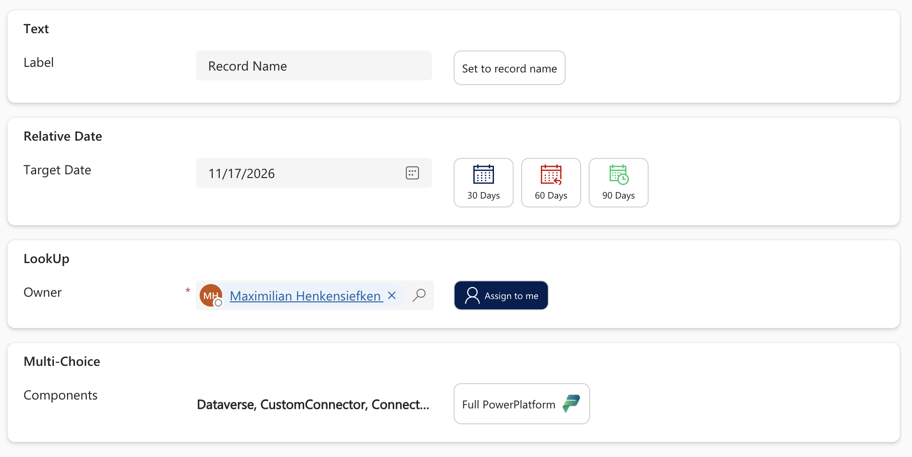

[← Back to main README](../README.md)

# ⚡ Quick Action Buttons Component

A field control that is **not bound to any single field's value**. It renders up to 5 configurable icon+label buttons; clicking one writes a maker-configured set of field values onto the **current form** — no Dataverse save, just the same in-memory field update a user typing into the form would produce.


*Four independent buttons, each writing a different kind of target field - a literal text value, a relative-date expression, an "assign to me" lookup, and a multi-select choice.*

## Features
- **Up to 5 independently configured buttons** — each has its own Label, Icon, optional Accent color, optional Tooltip, and an Actions JSON map. A button with no Label configured is simply not rendered, so 1–5 buttons all work without a separate "how many buttons" setting.
- **Full MDL2 icon support**, same icon-name/Unicode/CSS-class/image-web-resource resolution as [Modern Choice Buttons](ModernChoiceButtons.md) and [Advanced Dropdown](AdvancedDropDown.md) — an MDL2 name (browse and copy names at [flicon.io](https://www.flicon.io/) or [FLUENT_ICONS.md](../FLUENT_ICONS.md)), or a prefixed image web resource name (e.g. `hek_MyLogo.png`).
- **Actions JSON** — a plain map of *target field logical name → value* set on click. Values can be a literal (string/number/boolean/`null`), or an `@{...}`-wrapped expression using the function catalog below:
  ```json
  {
    "hek_status": "Approved",
    "hek_approvedon": "@{utcNow()}",
    "hek_summary": "@{concat(toUpper(hek_firstname), ' ', hek_lastname)}",
    "hek_daysoverdue": "@{sub(hek_duedays, 5)}",
    "hek_note": null
  }
  ```
- **Sets the field value only by default — does not save the form**, unless **Save record on click** is turned on. Off (the default), a click behaves exactly like a user editing that field directly: works on unsaved/new records, respects whatever else is unsaved elsewhere on the form, and leaves saving to the user (or the form's own automation) as normal. On, the record is saved immediately after that click's field values have all been set — the save always happens after, never before, the writes.
- **Per-button accent color**, usable as the background/border/icon color via the color-mode properties below (`Per-button color` mode) instead of one fixed color for every button.
- **Button shape/size**, show/hide label, bold label, icon position (Above/Below/Left/Right of the label), same visual language as Modern Choice Buttons.
- **Reflow behaviour**: `Wrap` (default) keeps every button at a fixed width, wrapping onto a new row once they no longer fit; `Flexible` shrinks or grows each button to exactly fit its icon and label instead.
- **Compact height for Small buttons with a Left/Right icon**: at Button size `Small` with Icon position `Left` or `Right`, the button's height is fixed to match a standard out-of-the-box Dataverse field row, so it lines up cleanly next to an adjacent field (e.g. an "Assign to me" button beside a lookup field).
- **Brief click confirmation** — the clicked button flashes its `Active (clicked) color` for a moment after a successful click, then fades back, as visual confirmation the action fired.
- **Expression lint (live syntax and field checking)** — if any button's Actions JSON is malformed (invalid JSON, not a JSON object, an unrecognized function name, or a broken `@{...}` expression), the control replaces the entire button row with a red error panel naming exactly which button and what's wrong, instead of silently rendering broken buttons. This runs on every render, including in the form designer's own live property preview, so a typo is visible immediately while configuring the control rather than only after clicking a button on a real form. Whenever the current form is reachable, this also checks that every target field (each JSON key) and every field referenced inside an `@{...}` expression actually exists on the record — a misspelled field name is flagged the same way as a syntax error.
- **Respects read-only and column security**: when the control is read-only (set on the form, or an inactive record) the buttons are dimmed and can't be clicked; a target field the current user isn't allowed to update (column-level security) is skipped and named in the error panel instead of failing at save time
- **Follows your app theme font**: uses the font of the app's modern [custom theme](https://learn.microsoft.com/power-apps/maker/model-driven-apps/modern-theme-overrides) (the `font` of its Custom theme definition), falling back to Segoe UI when no custom theme is set or the font can't be displayed

## Properties

| Property | Type | Options | Description | Default |
|---|---|---|---|---|
| Bound field (unused) | Any | — | Bind to any existing column so the control can be added to the form. Its value is never read or displayed. | — |
| Save record on click | Two Options | — | If on, saves the record immediately after a click's field values have been set. | No |
| Button 1–5: Label | Text | — | Text shown on the button. Blank = button hidden. | — |
| Button 1–5: Icon | Text | — | MDL2 icon name or image web resource name. | — |
| Button 1–5: Accent color | Text | Hex | Optional accent color used by `Per-button color` modes. | — |
| Button 1–5: Tooltip | Text | — | Optional hover tooltip text. | — |
| Button 1–5: Actions (JSON) | Text (Multiple) | — | Field → value/expression map applied on click. | — |
| Button shape | Enum | Square / Rounded | Corner shape. | Rounded |
| Button size | Enum | Small / Normal / Large | Overall button size; icon stays a fixed size. | Normal |
| Show label | Two Options | — | Show/hide the label text under the icon. | Yes |
| Icon position | Enum | Above / Below / Left / Right | Position of the icon relative to the label. No effect when Show label is off. At Button size Small with Left/Right, the button's height also matches a standard OOB field row. | Above |
| Reflow behaviour | Enum | Wrap / Flexible | Wrap keeps each button at a fixed width and wraps onto a new row when out of space; Flexible sizes each button to fit its icon + label. | Wrap |
| Make font bold | Two Options | — | Bold label text. | No |
| Background color mode | Enum | Fixed / Per-button color | Resting background source. | Fixed |
| Button color | Text | Hex | Resting background when mode is Fixed. | `#FFFFFF` |
| Hover color | Text | Hex | Background while hovered. | `#DEECF9` |
| Active (clicked) color | Text | Hex | Brief flash background right after a click. | `#C7E0F4` |
| Border mode | Enum | Off / Fixed / Per-button color | Border source. | Fixed |
| Border color | Text | Hex | Border color when mode is Fixed. | `#D2D0CE` |
| Icon color mode | Enum | Automatic / Fixed / Per-button color | Icon color source. | Automatic |
| Icon color | Text | Hex | Icon color when mode is Fixed. | `#201F1E` |

## Expression Reference

Each Actions JSON value is resolved as follows:
- A JSON string **wrapped in `@{...}`** → the inner text is parsed and evaluated as an expression.
- A JSON **object with an `id` property**, e.g. `{"id":"<guid>","entityType":"systemuser"}` → a literal lookup value (see **Lookup fields** below).
- Any other JSON string, number, boolean, or `null` → used **literally** (no `@{}` needed for a fixed value).

Inside an expression, a bare word (e.g. `hek_duedate`) that isn't a function call is a reference to **another field on the current record** — its current in-memory value (including unsaved edits), read the same way it's written: via the form's own field objects, not a fresh Dataverse fetch.

String literals use single quotes, with `''` as an escaped single quote (e.g. `'it''s approved'`) — the same convention Power Automate/Logic Apps expressions use. Function names are not case-sensitive (`toUpper`, `TOUPPER` and `toupper` are the same), field names are.

**The fields of one button are set in order**, top to bottom: each value is worked out and written before the next one, so a later entry sees what an earlier one just wrote. `{"hek_status": 100000003, "hek_previousstatus": "@{hek_status}"}` copies the *new* status, not the old one; put the copy first to keep the old value.

Supported functions (Power Automate names and results; the few extras are listed below the table):

| Category | Functions |
|---|---|
| String | `concat(...)`, `toUpper(text)`, `toLower(text)`, `trim(text)`, `substring(text, start, length?)`, `replace(text, old, new)` *(replaces every occurrence)*, `length(text)` |
| Math | `add(a,b)`, `sub(a,b)`, `mul(a,b)`, `div(a,b)`, `mod(a,b)`, `min(...)`, `max(...)`, `abs(a)`, `round(a, digits?)` *(`abs` and `round` are extras that Power Automate doesn't have)* |
| Date | `utcNow(format?)`, `addSeconds(ts, n, format?)`, `addMinutes(ts, n, format?)`, `addHours(ts, n, format?)`, `addDays(ts, n, format?)`, `addToTime(ts, interval, unit, format?)` *(unit: Second/Minute/Hour/Day/Week/Month/Year)*, `formatDateTime(ts, format?)`, `ticks(ts)` |
| Logic | `coalesce(...)` — the first argument that isn't `null` (as in Power Automate, an empty text `''` counts as a value) |
| User | `me()` — the current user, as a lookup value (`{id, entityType: "systemuser", name}`) |
| Random | `guid()` — a freshly generated GUID string; `rand(min, max)` — a random integer, inclusive at `min`, exclusive at `max` |

Examples:
```
@{toUpper(hek_name)}
@{concat(hek_firstname, ' ', hek_lastname)}
@{round(mul(hek_amount, 1.19), 2)}
@{addToTime(hek_startdate, 1, 'Month')}
@{addDays(utcNow(), 5)}
@{formatDateTime(utcNow(), 'yyyy-MM-dd')}
@{coalesce(hek_preferredname, hek_firstname, 'Unknown')}
@{me()}
@{guid()}
@{rand(1, 100)}
```

How they behave (as in Power Automate):
- **`div(a, b)`** of two whole numbers is a whole number, cut off toward zero: `div(7, 2)` is `3`, `div(-7, 2)` is `-3`. With a decimal on either side it divides exactly: `div(7, 2.0)` is `3.5`, `div(hek_amount, 3)` is exact when the amount has decimals. Dividing by zero (`div` or `mod`) is an error.
- **Dates and times are in UTC.** `utcNow()` is the current moment, the `add...` functions count in UTC, and `formatDateTime` prints UTC. A **Date Only** field is read as its own calendar day (midnight UTC), so `formatDateTime(hek_duedate, 'yyyy-MM-dd')` and `addDays(hek_duedate, 1)` give that day and the next, whatever the user's time zone.
- **`addToTime` with `Month` or `Year`** keeps the day of the month, clamped to the last day of a shorter month: 31 January plus one month is 28 February (29 in a leap year).
- **The date functions take an optional last `format`** and then return text instead of a date: `utcNow('yyyy-MM-dd')`, `addDays(hek_duedate, 7, 'dd.MM.yyyy')`.
- **`formatDateTime(ts, format?)`** uses .NET date formats, in English (en-US):
  - Without a format, or as text (e.g. `concat('Due ', hek_duedate)`), a date prints in the round-trip format `2026-01-31T10:20:30.0000000Z`.
  - Standard formats (one letter): `d` 1/31/2026, `D` Saturday, January 31, 2026, `f` …10:20 AM, `F` …10:20:30 AM, `g` 1/31/2026 10:20 AM, `G` 1/31/2026 10:20:30 AM, `M` January 31, `o` 2026-01-31T10:20:30.0000000Z, `r` Sat, 31 Jan 2026 10:20:30 GMT, `s` 2026-01-31T10:20:30, `t` 10:20 AM, `T` 10:20:30 AM, `u` 2026-01-31 10:20:30Z, `Y` January 2026.
  - Custom formats combine `yyyy`/`yy`, `MMMM`/`MMM`/`MM`/`M`, `dddd`/`ddd`/`dd`/`d`, `HH`/`H` (24-hour), `hh`/`h` (12-hour) with `tt` (AM/PM), `mm`/`m`, `ss`/`s` and `fff` (fractions). Text in single quotes is printed as is; inside an expression's own quotes write them doubled: `formatDateTime(hek_duedate, '''Week of'' dd MMM')` gives *Week of 31 Jan*. `MM` is the month and `mm` the minutes.
- **`ticks()`** returns .NET-style ticks (100ns units since `0001-01-01`), not Unix time.

Extras that Power Automate doesn't have:
- **`abs(a)`** and **`round(a, digits?)`**. `round` rounds halves away from zero (`round(2.5)` is `3`, `round(-2.5)` is `-3`, `round(1.005, 2)` is `1.01`); negative `digits` round to tens, hundreds and so on (`round(1234.5, -2)` is `1200`).
- **`me()`**: the current user as a lookup value.
- Numbers written as text (`add('1.5', 2)`) are accepted where Power Automate would need `float()` or `int()` first.

**Putting a date into a Date Only or Date and Time field**: the value can be a date (e.g. `utcNow()`, `addDays(...)`) or text, including anything `formatDateTime` prints, so `{"hek_duedate": "@{formatDateTime(addDays(utcNow(), 7), 'D')}"}` works. Text is read like this:
- **Time zone:** text without a time zone is UTC, like every date function here; ISO text with `Z` or `+02:00` uses that zone.
- **Date and Time fields** get that moment, shown in the user's own time zone on the form.
- **Date Only fields** get that calendar day, whatever the user's time zone.
- **ISO** `2026-01-31`, `2026-01-31 10:20`, `2026-01-31T10:20:30Z` and every standard format above, except the time-only `t` and `T`.
- **Numbers with dots or dashes are day first**: `31.01.2026`, `31-01-2026 14:05`.
- **Numbers with slashes are month first**, like the `d` format (`1/31/2026`), unless the first number can't be a month (`31/01/2026`).
- **Month names in English:** `31 January 2026`, `Jan 31, 2026 10:20 AM`.
- Text that isn't a valid date (e.g. `31.02.2026`) leaves the field unchanged and is reported in the red panel.

**What each field type accepts** (anything else leaves that field unchanged and lists it in a red panel under the buttons, while the button's other fields are still set):
- **Text**: any value. Numbers and `true`/`false` become their text (`42`, `true`), a date or time becomes `2026-01-31T10:20:30.0000000Z` (UTC, the round-trip format), and a lookup (e.g. `me()`) becomes its name. Dataverse removes leading and trailing spaces from text fields.
- **Whole number, decimal, floating point, currency**: a number, or text that is a number (`"42"`).
- **Date Only, Date and Time**: a date/time result, or date text (see **Putting a date into a Date Only or Date and Time field** above).
- **Yes/No**: `true`/`false`, the text `"true"`/`"false"`, or a number (`0` is No, anything else Yes).
- **Choice, multi-select choice, lookup**: see below.
- **`null`** (or an expression that returns nothing) clears any field.

### Lookup fields

A lookup target field (including polymorphic ones like `ownerid`, which accepts a user or a team) can be set from:
- **Another lookup field**, e.g. `{"ownerid": "@{hek_alternateowner}"}`.
- **The current user**, via `me()` — e.g. `{"ownerid": "@{me()}"}`, the "assign to me" pattern.
- **A literal record**, as a JSON object: `{"ownerid": {"id":"<guid>","entityType":"systemuser"}}`. `entityType` can be omitted when the target field's lookup only ever accepts one table (e.g. a lookup to Contact); it's required for a lookup that accepts more than one table (like `ownerid`), since there's no way to infer which one is meant.

### Choice (Option Set) fields

- **A hard value**: the underlying numeric option value, e.g. `{"hek_status": 100000001}` — not the label text, there is no label lookup.
- **Another choice field**: e.g. `{"hek_status": "@{hek_otherstatus}"}`.

### Multi-select choice fields

Represented as a **comma-separated string of numeric option values**, the same shape returned by the Dataverse Web API — not a JSON array:
- **A hard value**: `{"hek_multichoice": "100000001,100000002"}`.
- **Another multi-select field**: `{"hek_multichoice": "@{hek_othermultichoice}"}`.

## Known Limitations

- **`Xrm.Page` dependency**: field reads/writes go through the classic `Xrm.Page` API, which Microsoft has deprecated (though it remains present). If it's ever unavailable, all buttons disable themselves with an explanatory tooltip rather than failing silently.
- **Choice/Option Set target fields** must resolve to the underlying **numeric option value**, not the option's label text — there is no label lookup.
- **A polymorphic lookup target field** (one that accepts more than one table, e.g. `ownerid`) requires `entityType` to be specified explicitly in a literal value, or requires the source field/`me()` to already carry it — it cannot be inferred.
- **Field names are Dataverse logical names** (e.g. `hek_status`), not display names, and are case-sensitive.
- **The local PCF test harness cannot exercise the real form connection** — there is no live `Xrm.Page` at `localhost:8181`, so the harness always runs against an in-memory test fixture record instead. Confirming the real behavior, including **Save record on click**, needs a real Dataverse form.
