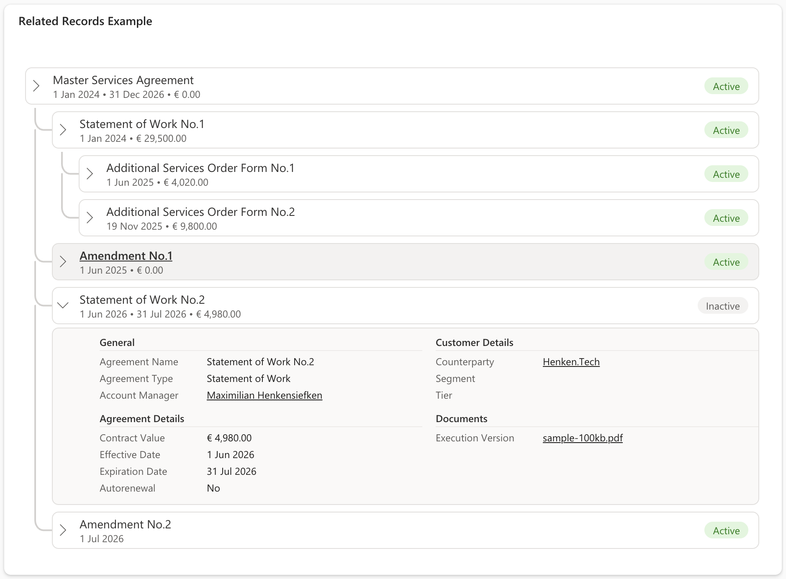
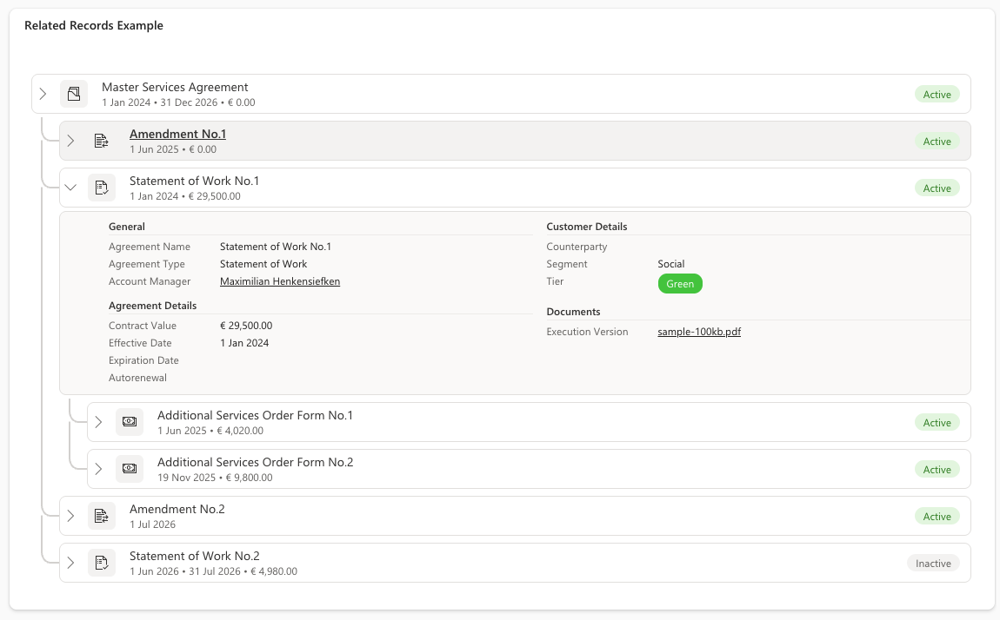
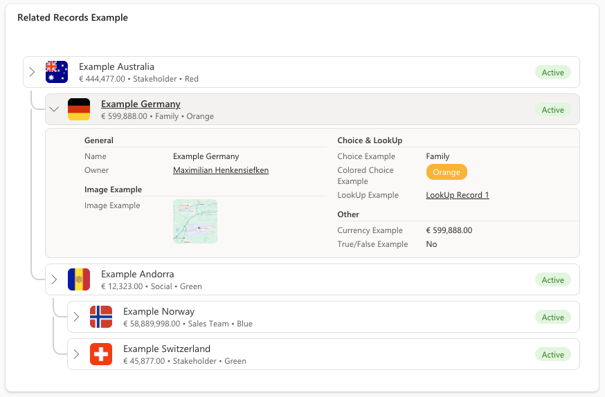
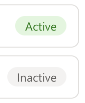

[← Back to main README](../README.md)

# 🌳 Relationship View Component

A field control, bound directly to a self-referential lookup (e.g. "Parent Contract"), that replaces the field with the record's full ancestor/descendant hierarchy - one continuous tree, rendered inline on the form, with each row expandable into a live Quick View panel.

*The complete ancestor chain and descendant tree in a single view, including sister records (other Order Forms sitting alongside the same Statement of Work) and an expanded Quick View panel for the selected row.*

 

*A contract/amendment/SOW hierarchy (left) and a generic parent/child hierarchy with custom attributes, a country-flag icon thumbnail, and a colored Choice field (right).*

## Features
- **Full Ancestor + Descendant Tree**: walks upward to the root and downward to the leaves from wherever the control is placed, stitched into one continuous tree with SVG connector lines - no need to open each related record separately to see how they relate
- **Configurable Depth**: `Max Parent Levels`/`Max Child Levels` independently cap how far the tree walks in each direction - `0` disables that direction entirely, `-1` (default) walks all the way, or cap it to a specific number of levels
- **Sister Records**: optionally show other records that share the same immediate parent as a given node - **Direct Only** shows just the sister records, **Sister Plus Children** also shows each sister's own descendant tree - applied at every level of the ancestor chain, not only the current record's own level
- **Same-Level Sorting**: order children and sister records by any column, ascending or descending, instead of default fetch order
- **Live Quick View Panel**: expand any row's chevron to see that record's fields laid out exactly like a real Dataverse **Quick View Form** (or **Main Form**) - the same tabs, columns, and sections, with hidden/conditional fields correctly excluded
- **Type-Aware Field Formatting**: Money, DateTime (in the browser's own locale), Choice, and clickable Lookup fields are all formatted the same way the platform does natively
- **Inline Image & PDF Previews**: click an Image or PDF field inside the Quick View panel to preview it larger in a callout - images load at full original resolution, PDFs open in the browser's native viewer
- **Choice Color Display**: show a Choice field's configured color in the Quick View panel as plain text (**None**), a **Circle**, a filled **Pill**, or colored **Font**
- **Active/Inactive State Pills**: shows each record's state, with an option to exclude inactive records - and everything below them - from the tree entirely
- **Custom Attribute Columns**: up to three additional columns shown directly in each row's subtitle
- **Flexible Thumbnails**: point at an Image column, or a text column holding an MDL2 icon name (detected automatically) - with 3 frame shapes (Circle/Square/Rounded Square) and 7 fill modes (Cover/Stretch/Contain/Center/Tile/Fit Width/Fit Height)
- **Configurable Indentation & Highlight**: adjust how far each tree level indents, and the highlight color used for the current record's row
- **Cycle-Safe**: a shared visited-node guard protects against a corrupted self-referential lookup accidentally forming a cycle and infinite-looping the tree walk

### Choice Color Display

  

*Left to right: Circle, Pill, and Font - the same "Tier" Choice value shown with each `choiceColorDisplay` mode.*

### Active/Inactive State

*The state pill shown per record when `showState` is enabled.*

## Properties

| Property | Type | Options | Description | Default |
|----------|------|---------|-------------|---------|
| `parentLookup` | Lookup | - | **Required.** The self-referential lookup field (e.g. Parent Contract) that defines where this record sits in the hierarchy. Place the control directly on that field | - |
| `showState` | Yes/No | - | Show an Active/Inactive pill for each record | Yes |
| `showInactiveRecords` | Yes/No | - | Include inactive records (and everything below them) in the tree. When off, inactive branches are left out entirely and the state pill is hidden | Yes |
| `maxParentLevels` | Number | -1 / 0 / N | Ancestor levels to walk upward. `0` disables ancestor lookups entirely, `-1` walks all the way to the root | -1 |
| `maxChildLevels` | Number | -1 / 0 / N | Descendant levels to walk downward. `0` disables descendant lookups entirely, `-1` walks all the way to the leaves | -1 |
| `siblingDisplay` | Choice | None/DirectOnly/SistersAndChildren | Show other records sharing the same immediate parent - none, sister records only, or sister records plus their own descendant trees | None |
| `sortByColumnName` | Text | - | Logical name of a column used to order records that share the same tree level (children under a shared parent, and sister records) | - |
| `sortDirection` | Choice | Ascending/Descending | Sort direction when `sortByColumnName` is set | Ascending |
| `currentRecordHighlightColor` | Text | Hex Color | Highlight color for the current record's row | #F3F2F1 |
| `customAttribute1` / `2` / `3` | Text | - | Logical name of a column to display in each record's row subtitle | - |
| `thumbnailColumnName` | Text | - | Logical name of a column to render on the left of each row - an Image column, or a text column holding an MDL2 icon name (detected automatically) | - |
| `thumbnailStyle` | Choice | Circle/Square/RoundedSquare | Shape of the thumbnail frame | Circle |
| `thumbnailRenderingOption` | Choice | Cover/Stretch/Contain/Center/Tile/FitWidth/FitHeight | How the thumbnail image fills its frame | Cover |
| `quickViewFormName` | Text | - | Unique name of a Quick View Form (a Main Form's name also works) on this table. When set, each row gets an expand chevron showing that form's fields | - |
| `choiceColorDisplay` | Choice | None/Circle/Pill/Font | How Choice field colors are shown in the Quick View panel | None |
| `indentation` | Choice | Low/Medium/High | How far each ancestor/descendant level is indented relative to its parent | Medium |

## Configuring the Control

Unlike PDF Gallery, Relationship View is a **field** control, bound the same way as Risk Matrix - place it directly on the self-referential lookup field itself:

1. On the table's form, select the self-referential lookup field (e.g. "Parent Contract", pointing back to the same table).
2. Add **Relationship View** as a component on that field.
3. Configure the optional properties as needed - at minimum, consider setting `quickViewFormName` so each row gets an expandable detail panel.
   - `maxParentLevels`/`maxChildLevels` to cap how far the tree walks in each direction
   - `siblingDisplay` to show other records sharing the same parent
   - `quickViewFormName` to give each row an expandable Quick View panel
   - `thumbnailColumnName`, `customAttribute1`/`2`/`3`, `choiceColorDisplay`, `indentation`, and `currentRecordHighlightColor` to tune the visual presentation

> [!NOTE]
> **Why a Quick View Form name also accepts a Main Form's name:** There is no supported way to embed Microsoft's native Quick View Form control inside a custom PCF control, so the component fetches the named form's `formxml` directly from the table's form definitions and parses it client-side to reproduce the same tabs/columns/sections layout. Since any form matching that name on the table is used (not only ones of type "Quick View Form"), a Main Form's name resolves identically - useful if you'd rather reuse a form you've already built than create a dedicated Quick View Form.

## Use Cases
- Contract hierarchies - Master Agreement → Amendments → Statements of Work → Order Forms
- Case or matter escalation chains
- Any Parent/Child record chain modeled with a self-referential lookup instead of Dataverse's native Hierarchical relationship type
- Org charts, approval chains, or any other tree-shaped record structure

---

[← Back to main README](../README.md)
