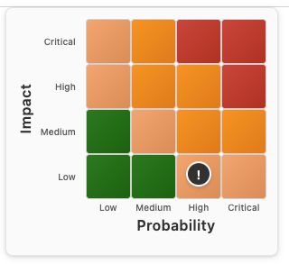
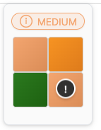
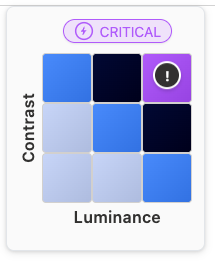
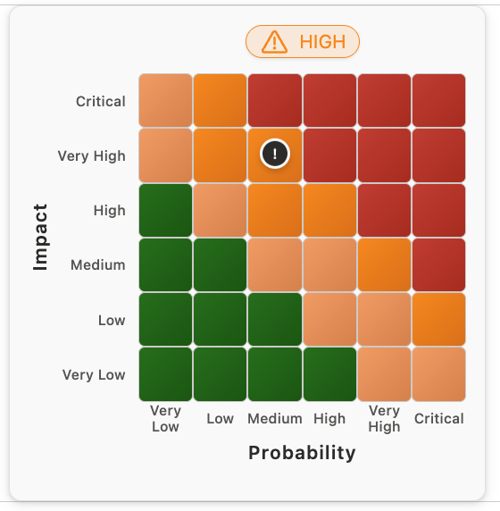

[← Back to main README](../README.md)

# 🎯 Risk Matrix Component

An interactive risk assessment matrix that allows users to plot and visualize risk items based on Impact and Probability ratings.

 

*Risk Matrix component showing standard configuration with labels (left) and clean presentation without category labels (right)*

 

*Modern pill-style risk indicator with dynamic color-coding (left) and expanded 6x6 grid configuration (right)*

## Features
- **Flexible Grid Sizes**: 2x2, 3x3, 4x4, 5x5, or 6x6 grid configurations to match your risk assessment needs
- **Dynamic Risk Labels**: real-time risk level display at the top of the matrix (LOW, MEDIUM, HIGH, CRITICAL)
- **Custom Axis Labels**: configurable X and Y axis labels (default: "Impact" and "Probability")
- **Multiple Size Options**: Small (compact), Large (detailed), or Huge (extra-large) display modes
- **Granular Label Control**: independently toggle category scale labels (Low/Medium/High/Critical) and axis title labels (Impact/Probability)
- **Customizable Colors**: configurable color scheme for each risk level (Low, Medium, High, Critical)
- **Real-time Updates**: marker position and risk label update live as Impact and Probability values change
- **Responsive Design**: precise positioning across all size and grid configurations
- **Visual Feedback**: color coding and smooth hover effects make risk levels clear at a glance
- **Professional Styling**: modern Fluent UI design system with smooth transitions

## Properties
| Property | Type | Options | Description | Default |
|----------|------|---------|-------------|---------|
| `Impact` | Number | 1-2, 1-3, 1-4, 1-5 or 1-6 | Impact level of the risk item (range depends on grid size) | - |
| `Probability` | Number | 1-2, 1-3, 1-4, 1-5 or 1-6 | Probability level of the risk item (range depends on grid size) | - |
| `Size` | Choice | Small/Large/Huge | Matrix size: Small (compact), Large (detailed), or Huge (extra-large) | Small |
| `GridSize` | Choice | 2x2/3x3/4x4/5x5/6x6 | Grid configuration: 2x2, 3x3, 4x4, 5x5, or 6x6 matrix | 4x4 |
| `ShowCategoryLabels` | Yes/No | - | Show or hide scale labels (Low, Medium, High, Critical) | Yes |
| `ShowAxisLabels` | Yes/No | - | Show or hide axis title labels (Impact/Probability) | Yes |
| `ShowRiskLabel` | Yes/No | - | Show or hide current risk level label at top of matrix | Yes |
| `ImpactLabel` | String | - | Custom label for the Y-axis (vertical) | "Impact" |
| `ProbabilityLabel` | String | - | Custom label for the X-axis (horizontal) | "Probability" |
| `LowColor` | String | Hex Color | Color for low-risk areas | #107c10 |
| `MediumColor` | String | Hex Color | Color for medium-risk areas | #faa06b |
| `HighColor` | String | Hex Color | Color for high-risk areas | #ff8c00 |
| `CriticalColor` | String | Hex Color | Color for critical-risk areas | #d13438 |

## Configuring the Control

1. After importing the solution, the Risk Matrix control will be available in your Power Apps
2. Add the control to a form or canvas app
3. Bind the Impact and Probability properties to your data fields
4. Optionally customize the risk colors and select the desired matrix size (Small, Large, or Huge) using the `Size` property

## Use Cases
- Legal risk assessments
- Compliance monitoring
- Project risk evaluation
- Strategic planning sessions
- Risk reporting dashboards

---

[← Back to main README](../README.md)
